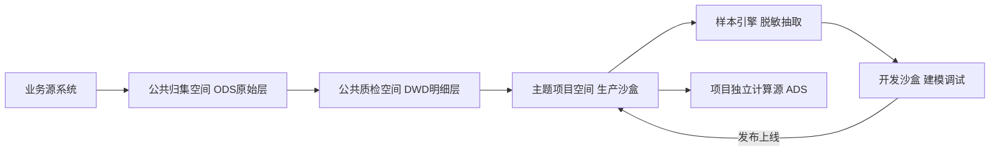
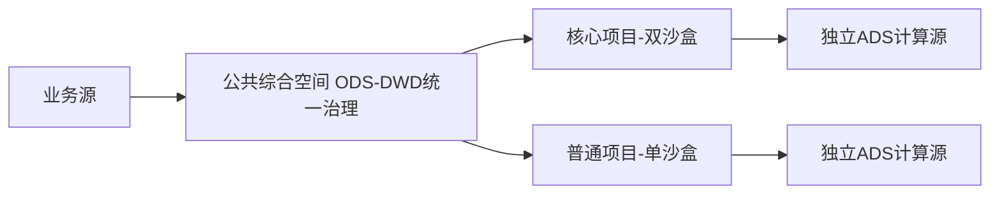
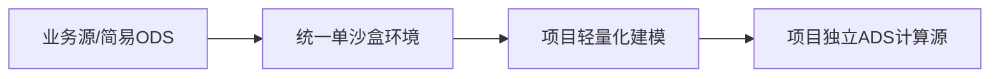

[TOC]

# FAQ（常见问题）

本文档汇总了 Ottomi Nexus 用户常见的问题与解答。如果您的问题未在此列出，欢迎通过 [GitHub Issues](../../issues) 提交，或发送邮件至 info@oceandatum.com 咨询。

---

## 1. 产品与商业化 FAQ

### 1.1 Ottomi Nexus产品核心定位是什么？主要解决哪些业务问题？

Ottomi Nexus 是由上海奥腾计算机科技有限公司（Oceandatum）自主研发的多模态 AI 数据中台。基于 DataOps 理念，定位于企业级全链路数据处理平台，核心理念是"连接资源、协同业务、安全管控"。

平台主要解决以下企业数据痛点：

- **破除数据孤岛**：原生支持数十种主流异构数据源，并提供 JDBC 驱动扩展机制，只需提供对应数据库驱动、简单适配方言和建表语句即可快速接入更多数据源类型，统一整合各业务系统数据
- **降低治理成本高**：AI 辅助完成数据归集、质检、标准推荐，减少人工密集型操作
- **筑牢安全合规**：自动分类分级扫描、数据血缘追踪、双沙盒隔离、全操作审计
- **降低使用门槛高**：可视化拖拽式操作，业务人员也能参与数仓建模与数据分析
- **简化部署运维复杂**：单包一键部署，支持内网无网环境运行

### 1.2 基础版、高级版、集团版核心差异有哪些？

三个版本使用**同一个安装包**，基础班**核心功能完全对齐无阉割**，且社区版持续共享最新功能升级，差异仅在于资源使用上限和服务等级：

| 对比项 | 基础版 | 高级版 | 集团版 |
|--------|--------|--------|--------|
| 价格 | 永久免费 | 商业授权 | 商业授权 |
| 并行计算节点 | 1 个 | 2+ 个，可按需扩容 | 无限制 |
| 注册用户数 | 8 人 | 40 人 | 无限制 |
| 项目空间数 | 30 个 | 150 个 | 无限制 |
| 数据源数量 | 12 个 | 60 个 | 无限制 |
| 数据模型数 | 500 个 | 2500 个 | 无限制 |
| 指标模型数 | 100 个 | 500 个 | 无限制 |
| 调度任务数 | 300 个 | 1500 个 | 无限制 |
| 数据服务 / API | 200 个 | 1000 个 | 无限制 |
| 专属技术支持 | 无（社区支持） | 金牌服务（4h 响应） | 铂金服务（2h 响应） |
| 适用场景 | 中小微企业、个人、测试验证 | 中型企业、多业务线 | 集团企业、超大规模 |

### 1.3 基础版永久免费的使用范围与限制是什么？

**使用范围**：

- 面向中小微企业、初创团队、个人开发者，无需企业认证即可使用
- 支持完全私有化部署，所有数据运行在自有服务器 / 内网
- 核心功能完全开放，包含数据接入、AI辅助 数据治理、数仓建模、数据资产管理、基础 BI 分析、权限管控

**缺省限制**：

- 资源上限见上表，达到上限后需升级到商业版解除限制
- 不提供一对一专属技术支持、深度排查或上门服务
- 不开放 Case 提报权限（可单独购买原厂服务）
- 默认通过 GitHub Issues 公共社区获取通用问题解答

### 1.4 商业版授权模式、授权类型与使用边界说明

**授权模式**：

- 实行**永久授权 + 年度服务分离**机制
- 永久授权长期有效，主线版本迭代功能可免费升级
- 年度服务到期仅关闭人工技术支持与 Case 权限，不会锁定已解锁的软件资源

**授权类型**：

- **高级版**：完成商业授权后，发放设备专属 License，与 MAC 地址唯一绑定
- **集团版**：必须在高级版授权基础上升级，替换全域无限制 License，保留原有配置与数据

**解锁方式**：通过软件管理中心生成环境码（基于 MAC 地址等硬件信息），官方根据环境码生成激活码，输入后即可解锁。

**使用边界**：严禁破解、篡改 License 授权，严禁非授权商用、二次分发。详见 [LICENSE](./LICENSE)。

### 1.5 产品开源与闭源边界如何划分？哪些模块会开放源码？

**闭源部分（ 数据中台核心）**：

- 数据中台核心数据处理能力
- 安全管控与权限体系

**计划开源部分（上层数据应用）**：

- 主数据管理（MDM）
- 智能问数 / 智能问答
- 多模态搜索
- 可信数据空间前端模块
- 智能中心 API / MCP 调用示例与开发规范

开源模块将附带部署、使用、开发文档，并建立与闭源底层的持续兼容机制。详见 [ROADMAP](./ROADMAP.md)。

### 1.6 是否支持私有化部署、离线环境、内网隔离使用？

支持。Ottomi Nexus 支持以下部署模式：

- **私有化部署**：所有业务数据与服务均运行在企业自有服务器内，从源头杜绝数据外泄风险。
- **离线部署**：支持先在联网环境完成完整安装并自动下载全部依赖组件，打包整体程序目录后，拷贝至内网环境即可直接部署运行，全程无需外网访问。
- **内网隔离**：适配纯无网、物理隔离等严苛办公环境，全面满足政企单位安全合规管控要求。

### 1.7 不同行业（制造 / 政务 / 金融 / 能源水利等）适配能力如何？

Ottomi Nexus 专为数据密集、合规要求高的场景设计，已在多个行业落地：

| 行业 | 典型场景 |
|------|----------|
| 政务 | 跨部门数据共享、数据要素流通、公共数据资源归集（已落地闵行区等） |
| 金融 | 客户资产整合、交易数据合规审计、监管报表 |
| 制造 | 生产全链路数据治理、供应链协同 |
| 能源水利 | 设备物联数据归集、生产运营数据分析 |
| 医疗教育 | 科研数据管理、教学资源整合 |
| 零售电商 | 多渠道数据融合、消费者画像分析 |
| 交通物流 | 物联网设备数据实时处理（已落地浦东机场等） |

平台支持根据行业特性快速定制落地方案。

### 1.8 版本升级规则、迭代节奏、更新保障机制

- 官方持续迭代维护，不定期发布版本更新

- 核心更新包含 Bug 修复、系统性能优化、核心功能增强

- **基础版（免费）**：可以自行下载安装包、手动升级主线迭代版本，完全免费

  **商业版（付费）**：免费升级 + 官方运维保障、技术支持、专属服务

- 所有版本发布内容以 GitHub Releases 为准

- 后续将逐步开源上层数据应用层模块

### 1.9 商业售后支持范围、服务响应规则、技术支撑方式

技术支持分为三档：

| 服务档位 | 适配版本 | 服务模式 | 响应时效 | 年度 Case 额度 |
|----------|----------|----------|----------|----------------|
| 银牌 | 基础版（需购买） | 5x8 远程 | 8 小时 | 32 次/年 |
| 金牌 | 高级版 | 5x8 远程 | 4 小时 | 32 次/年 |
| 铂金 | 集团版 | 7x24 远程 | 2 小时 | 32 次/年 |

Case 计次标准：轻量 Case（功能指导、配置解释，30 分钟内）计 0.5 次；常规 Case（故障排查、接口调试等）计 1 次。

因产品原生 Bug 导致的问题不扣减 Case 次数。

### 1.10 合作对接、定制开发、项目定制化服务是否支持？

支持。全版本客户均可选购以下增值服务：

- **现场实施**：驻场部署、环境调试、落地培训、本地化适配
- **专属运维**：长期驻场、7x24 应急保障、定期巡检
- **定制开发**：功能改造、第三方系统集成、个性化接口开发
- **咨询规划**：数据中台顶层设计、行业数据模型搭建
- **商务支撑**：招投标资料提供、验收配合、资质授权

商务合作、渠道转售等需求可联系 info@oceandatum.com。

---

## 2. 快速入门 & 基础使用 FAQ

### 2.1 初次上手 Ottomi，整体操作流程是什么？

平台采用 **「全局统一规划、全局集中治理，开发能力下沉项目、项目空间独立隔离」** 的设计思路：业务规划统一创建项目空间，数据归集、开发、建模、机器学习均在项目空间内闭环运行；数据质量与治理采用全局中心化管控，高权限统一核验全链路真实数据，同时通过项目空间 + 沙盒机制实现开发权限与数据隔离，兼顾治理管控安全与项目灵活迭代。

- 全局统一规划：业务规划、数据源注册、基础权限配置

- 全局集中治理：数据质量中心、全局质检、统一治理管控

- 开发归口项目：数据归集、开发、建模、机器学习均在项目内

- 项目逻辑隔离：双沙盒、权限边界、数据隔离机制

典型的新手使用流程如下：

1. **部署安装** -- 准备 Linux 服务器（8C16G），安装 Docker 和 Docker Compose，运行安装包启动服务。
2. **系统登录** -- 通过浏览器访问 `http://<服务器IP>:6626`，使用默认管理员账号登录。
3. **系统配置** -- 配置账号、角色、权限、消息通道。
4. **数据源接入** -- 在管理中心注册异构数据源，完成数据库连接配置，确定数据源、ODS、DWD数据库连接。
5. **业务规划** -- 创建项目空间，在项目空间中确定数据计算源（ADS），规划业务板块、主题域、业务实体。
6. **数据归集** -- 在项目空间中配置从数据源到ODS的数据归集任务。
7. **数据治理** -- 在独立全局的【数据质量管理中心】统一配置跨层级质检规则、数据标准，直接查看 ODS、DWD 真实业务数据，执行全链路质检；完成干净数据入仓、脏数据识别与治理，保障底层数据质量。
8. **数据开发** -- 经治理后的标准 DWD 数据，回到项目空间的数据开发环节；基于 DWD 层数据建模，最终沉淀到项目专属 ADS 计算层，支撑上层业务应用。通过可视化画布进行 ETL 开发和数仓建模。
9. **数据服务** -- 实现分类分级扫描，生成 API 接口，配置数据共享与权限审批。
10. **数据资产** -- 实现数据资产市场的目录展现和申请、审批运营流程闭环。在元数据管理中可以实现数据源表的资产上架，在业务规划-项目空间中实现计算源表、指标的资产上架、在数据共享服务模块中可以实现API上架。在数据资产管理菜单中**将可以**实现数据资产的统一上下架。


**权限设计逻辑**

- **数据治理角色**：全局级高权限，可查看全量真实原始数据、跨项目做质检治理，是平台数据质量的统一管控角色；
- **数据开发角色**：权限被约束在**所属项目空间**内，依托沙盒机制做隔离，看不到全局跨项目敏感数据，仅能操作本项目授权数据。


**数据归集菜单功能和数据开发中的数据输入组件有什么区别？**

都可以实现数据归集的能力，所不同点是：数据归集菜单是为了大规模多表从数据源到ODS层的数据归集而设计，采用的页面配置的方式实现，功能比数据输入组件更丰富一些。数据输入组件是为了ETL全流程而设计。


### 2.2 部署完成后，首次初始化需要做哪些步骤？

1. 确保服务启动成功（查看 `ocean-platform` 容器日志，出现启动成功提示即可）
2. 浏览器访问 `http://<服务器IP>:6626`
3. 使用默认管理员账号登录（首次登录后建议立即修改密码）
4. 进入系统后，可先浏览内置的 Demo 项目和数据空间，了解平台功能布局

### 2.3 支持哪些类型异构数据源快速接入？

平台基于自研数据处理引擎（深度改写自 Apache SeaTunnel），原生支持数十种主流异构数据源，主要包括：

- **关系型数据库**：MySQL、PostgreSQL、Oracle、DB2、SQL Server、达梦、人大金仓、OceanBase、TiDB 、ArgoDB、Greenplum等
- **大数据组件**：Hive、ClickHouse、Doris、Presto 、Inceptor等
- **消息队列**：Kafka 、Rabbitmq等
- **文件系统**：CSV、Excel、JSON、XML 等文件导入
- **API 接口**：支持通过 API 接口归集数据
- **非结构化数据**：文档分布式存储，文档摘要、关键词智能解析、图片OCR识别、音视频内容识别等，需要多模态大模型支持

### 2.4 如何新建项目、数据空间、业务主题目录？

1. 在「业务规划」模块中，先完成数仓分层设计（贴源层 ODS、明细层 DWD、应用指标层 ADS 等）
2. 创建业务板块，划分主题域和业务实体
3. 创建项目空间，分配计算资源和成员
4. 系统支持双沙盒架构：开发沙盒和生产沙盒隔离，保障数据安全

### 2.5 账号登录、角色权限、团队成员如何配置？

- **账号管理**：在「系统配置 > 账号管理」中添加成员、配置组织架构
- **角色管理**：预设多种角色（系统管理员、数据开发、数据分析师、业务用户等），支持自定义角色
- **权限管控**：支持数据源级、表级、列级、行级细粒度权限控制
- **统一认证**：内置统一身份认证体系，支持单点登录

### 2.6 基础数据同步、数据接入、基础加工如何操作？

**数据同步**：

- 库表归集：选择源端数据库和目标表，支持全量同步、增量同步、差异更新同步
- 实时归集：通过 CDC 机制实现实时数据同步
- 文件归集：上传文件并配置解析规则
- 接口归集：配置 API 地址和参数，定时拉取数据

**基础加工**：

- 使用数据开发模块的可视化画布，拖拽组件搭建 ETL 流程
- 内置 95+ 开发组件和 84+ 计算函数，覆盖常见数据加工场景
- 支持向导式 API 自动生成，无需手写接口代码

### 2.7 页面功能入口找不到、基础操作卡点如何自查？

1. 查看左侧导航栏的功能模块分组，确认当前所在模块
2. 利用页面顶部的搜索功能快速定位功能入口
3. 参考内置 Demo 项目的配置方式
4. 系统的智能中心模块将提供产品手册RAG知识库，可以解答用户的使用问题
5. 通过 [GitHub Issues](../../issues) 搜索或提交问题
6. 商业版用户可通过专属 Case 系统获取远程指导

### 2.8 浏览器兼容、前端访问、界面显示异常处理

- **推荐浏览器**：Chrome（最新版）、Edge（最新版）
- **访问地址**：`http://<服务器IP>:6626`
- **常见异常排查**：
  - 页面加载空白：检查服务是否正常启动，确认端口 6626 是否开放
  - 界面显示错乱：清除浏览器缓存后重试，或更换 Chrome 浏览器
  - 登录失败：检查账号密码是否正确，确认服务是否完全启动

### 2.9 基础功能试用建议，新手最简实践步骤

建议按以下顺序体验：

1. 浏览内置 Demo 项目，了解平台整体功能布局
2. 创建一个测试项目空间
3. 接入一个 MySQL 数据源，体验数据编目和归集
4. 尝试配置一条数据质检规则
5. 在数据开发画布中搭建一个简单的 ETL 流程
6. 体验数据资产管理中的资产查看和血缘追踪

### 2.10 日常使用高频注意事项与基础规范

- 操作前确认当前所在的项目空间和沙盒环境（开发/生产）
- 数据开发任务建议先在开发沙盒中验证，再发布到生产环境
- 开发沙盒的样本数据，可以利用样本引擎从生产环境的真实数据隐私转换而来
- 大批量数据任务执行建议错峰执行
- 定期检查数据质检报告，及时处理异常数据
- 风险操作（如删除数据源、删除项目）可能导致系统不可逆，请谨慎操作

### 2.11 首页全局模块有哪些？业务规划与项目空间是什么关系？项目空间的 Dev-Prod 模式和 Basic 模式有何区别？

#### 全局模块

首页中看到的研发中心、质量管理中心（含质检和治理）、共享服务中心、资产应用中心、数据标准、数据分析、智能中心、业务规划、管理中心都是**全局模块**，有系统权限和数据权限即可操作。

#### 业务规划与项目空间的关系

在**业务规划**模块中包含了**业务板块**和**主题域**建设。用户可以按照新建业务板块和主题域，然后建立对应的项目空间。项目空间可以添加和管理项目成员。

#### 项目空间模式

项目空间有 2 种模式：

1. **Dev-Prod 模式（双沙盒模式）**：生成互相关联的 Dev 开发环境和 Prod 生产环境。利用样本引擎从生产环境拉取生成样本数据进行开发；开发模型完成并上线后，可以发布到生产空间进行生产。生产空间中对应的是真实的生产数据，但数据浏览权限可以不对开发人员开放，开发人员仅能查看模型，从而减少数据泄漏的风险。

2. **Basic 模式（沙盒模式）**：开发与生产共用一个沙盒。

#### 项目空间模块选择

新建的项目空间可以选择研发中心中包含的模块。其中**数据建模**模块需要选择业务板块后才能使用。

---

## 3. 架构 & 技术集成 FAQ

### 3.1 Ottomi 整体技术架构、核心组件与设计理念？

**设计理念**：基于"**原子化组件 + 并行计算架构 + 可视化流程编排 + 数据处理闭环**"的框架设计，以 DataOps 为核心驱动，**通过组件化拆分实现全域能力解耦**，保障各业务模块独立迭代、灵活组合、按需组装。

**技术架构分层**：

- **数据接入层**：前置机编目归集（Ottomi-Atlas）、多源异构数据接入（数十种主流数据源，支持通过 JDBC 驱动扩展更多类型）
- **数据存储与计算层**：分布式并行计算引擎（Ottomi-Engine）、分布式任务调度引擎
- **数据治理层**：数据质量管理（Ottomi-Guardian）、数据标准管理、分类分级、数据安全（Ottomi-Secure）
- **数据开发层**：可视化 ETL 开发（Ottomi-Forge）、数仓建模（Ottomi-Metrix）、机器学习
- **数据资产层**：数据资产管理（Ottomi-Vault）、数据血缘、关系图谱、标签中心
- **数据服务层**：数据共享基地（Ottomi-ShareLink）、API 自动生成与管理、动态脱敏
- **可信数据空间**（Ottomi-TrustForge）：零信任架构、连接器管理、样本引擎

### 3.2 底层技术栈、依赖中间件、改造集成开源组件说明

**核心技术栈**：

- 云原生容器化架构（Docker / Docker Compose）
- 分布式并行计算与存储
- 微服务架构，各模块独立部署和扩展

**深度集成的开源组件**：

| 组件 | 协议 | 用途 |
|------|------|------|
| Apache SeaTunnel | Apache 2.0 | 数据集成与迁移 |
| Apache DolphinScheduler | Apache 2.0 | 分布式任务调度 |
| DataHub | Apache 2.0 | 元数据管理与数据目录 |
| DataEase | GPL-3.0 | BI 数据分析与可视化 |
| MinIO | AGPLv3 | 分布式对象存储服务，提供文档及各类文件存储能力。MinIO 独立部署、独立进程、API 调用（聚合），不改 MinIO 源码 |

完整组件清单和协议声明详见 [NOTICE](./NOTICE)。

**前置依赖**：

- Docker v28.3.3 及以上
- Docker Compose v2.36.1 及以上
- DataHub V1.30（元数据服务）

### 3.3 信创环境适配、国产数据库、国产服务器兼容情况

- **国产操作系统**：已适配基于 Debian / RedHat 的国产操作系统，持续进行信创实验室全功能验证
- **国产数据库**：支持达梦、人大金仓、OceanBase 、Gbase、Inceptor、argoDB、Starrocks等
- **服务器架构**：目前支持 X86_64，后续将开放 aarch64
- 平台已通过多项信创认证，满足政企合规要求

### 3.4 双沙盒机制、RBAC+ABAC 统一权限架构原理

**双沙盒机制**：

- 每个项目空间可配置独立的**开发沙盒**与**生产沙盒**双环境，也可按需选用开发生产一体化单沙盒模式，部署形态灵活适配不同业务规模。
- 开发环境默认使用脱敏仿真样本数据，研发人员全程不接触原始敏感业务数据，从环境层面筑牢数据安全底线。
- 开发调试、模型编排、任务配置等操作全部收敛在开发沙盒，验证通过后通过标准化发布流程，统一部署至生产沙盒正式运行。
- 依托双沙盒物理隔离能力，实现开发环境与生产环境的强隔离，有效规避误操作、数据泄露、逻辑冲突等风险。

**权限架构**：

- 平台搭建统一身份认证体系，实现全域账号统一管理、统一登录、统一鉴权。
- RBAC（基于角色的访问控制）：预设多种角色，支持自定义
- ABAC（基于属性的访问控制）：支持数据源级、表级、列级、行级细粒度权限
- 完整的权限审批流程：数据申请、审批、订阅、授权全流程管理

**沙盒数据处理与数仓流转全流程:**

全局统一数仓分层、独立项目空间隔离、项目专属计算源（ADS 指标层）、全域资产统一管理，形成完整、可落地的数据闭环。

1. 全局标准数仓链路：`业务源系统 → ODS原始层 → DWD明细标准层`
2. 项目专属计算源：每个项目空间自带独立计算源库，等效为**项目专属 ADS 指标层**，用于存储当前主题域的指标、维表、统计结果；
3. 数据隔离规则：各项目空间数据天然隔离，所有业务主题项目，统一从全局 DWD 明细层获取干净数据源；
4. 资产全域管理：平台区分资产管理、资产市场模块，可统一检索查看原始数据集、编目资源、各项目计算源指标与维表资产。

#### 3.4.1 大型复杂架构（集团级 · 全分工 · 标准双沙盒）

适配大型集团、多部门协作、数据治理要求高、岗位严格拆分的复杂场景。

**1）专属公共项目空间（平台侧统一治理）**

- **数据归集专属空间**：由专职归集人员负责，统一对接全业务异构数据源，完成数据同步与接入，将原始数据统一沉淀至**全局 ODS 原始层**，完整保留源数据原貌，作为全平台数据统一底座。
- **数据质检专属空间**：配置独立质检权限与专职质检团队，仅访问 ODS 全量真实数据，开展完整性、一致性、规范性、业务逻辑校验；完成数据清洗、标准化、脏数据治理后，高质量统一入**全局 DWD 明细标准层**；ODS、DWD 为全域共享基础层，是所有业务项目的统一数据来源。

**2）业务主题项目空间（业务侧建模产出）**

- 按主题域隔离建空间，按业务板块、主题域拆分独立项目空间，每个业务项目默认启用**双沙盒强隔离模式；**
- 所有业务项目**禁止直连业务源或 ODS 层**，统一从全局 DWD 明细层抽取主题相关干净数据，保障口径统一、数据质量可控；
- 双沙盒标准流转：
  - 生产沙盒：存储引用的 DWD 标准明细数据，为全域可信基准；
  - 样本脱敏同步：开发人员通过平台样本引擎，自定义抽取限量数据样本，经过隐私脱敏、可计算化处理后，同步至开发沙盒；
  - 离线开发建模：所有脚本开发、模型设计、指标加工、任务调试，全部在开发沙盒内完成；
  - 一键发布上线：模型与作业验收通过后，统一发布至对应项目生产沙盒；
  - 权限隔离约束：开发人员仅可查看模型与任务配置，**无生产原始数据查看权限**；

**3）项目专属 ADS 计算源产出**

每个项目生产沙盒配套**独立计算源库（项目级 ADS 层）**；加工后的业务指标、维度维表、报表结果、主题汇总数据，统一落地至当前项目 ADS 层，实现主题数据隔离存储、独立运维。

**4）全域资产统一管控**

平台资产管理模块统一纳管：ODS 原始数据集、DWD 标准明细、各项目独立 ADS 计算源、维表、指标资产；通过资产编目、标签、检索能力，实现全域数据资产可查、可管、可追溯，资产市场支持跨项目合规共享。




#### 3.4.2 中等通用架构（政企标准 · 混合灵活组合）

适配政企单位、中等规模企业，岗位可合并、治理适度规范、安全与效率兼顾的主流场景。

1. **公共治理简化合并**：数据归集、数据质检可合并在**同一个公共项目空间**内完成，保留 `ODS → DWD` 标准分层，保证基础数据治理能力不缺失。
2. **项目沙盒灵活选配**：核心涉密主题项目沿用**双沙盒隔离**；普通分析、非敏感业务项目直接使用**单沙盒一体化**，简化运维成本。
3. **数据来源规则不变**：所有业务项目仍以全局 DWD 明细层为统一数据源，保证数据口径统一；允许少量非核心场景按需简化链路。
4. **计算源与资产逻辑不变**：每个项目空间依旧独享独立 ADS 计算源层，指标、维表按主题隔离；全域资产统一录入编目，资产管理、资产市场功能正常复用，兼顾规范与灵活。



#### 3.4.3 轻量化简易架构（基础版 · 一体化极简）

适配小团队、部门级应用、快速落地、无严格岗位拆分的轻量化场景，为基础版默认形态。

1. **极简环境架构**：全局采用**单沙盒一体化模式**，不再拆分独立开发、生产环境，依靠 RBAC+ABAC 细粒度权限做逻辑隔离。
2. **链路大幅简化**：可按需弱化复杂分层——最简模式直接对接业务源系统做数据接入；标准简化模式精简保留 ODS 基础沉淀，轻量质检后直接供项目使用。
3. **项目建设方式**：不再拆分公共治理空间，数据接入、轻量质检、模型开发、指标产出全部在统一环境内完成；单人 / 小团队可全流程兼任，快速完成数据分析与报表搭建。
4. **保留核心产品能力**：即使极简部署，仍保留**项目独立计算源（ADS）**设计，指标、维表按项目隔离；基础资产编目、资产检索、资源透视能力完整保留，方便后期平滑升级扩容。



#### 3.4.4 三种模式核心逻辑汇总

| 核心逻辑 | 说明 |
|----------|------|
| 底层统一 | 无论哪种模式，全域以 `ODS 原始层 + DWD 标准明细层` 为公共底座，保障数据统一、质量统一 |
| 项目隔离 | 所有业务主题以独立项目空间为载体，数据天然隔离，按需选择双沙盒 / 单沙盒 |
| 计算源独立 | 每个项目自带专属 ADS 计算源层，统一存储指标、维表、业务结果数据 |
| 治理弹性 | 大型全岗位拆分、中等合并兼顾、小型极简轻量化，三套方案按需匹配 |
| 资产全域 | 统一资产管理与资产市场，原始数据、标准明细、项目指标资产全域可管、可查、可共享 |
| 版本全覆盖 | 完整适配基础版、高级版、集团版的差异化部署需求 |


### 3.5 多模态能力、AI 智能中心、知识库能力如何对接？

**多模态处理，有待提升**

- **文本**：关键词提取、摘要
- **图像**：物体识别、场景识别（调用多模态大模型能力）
- **音视频**：语音转文字、视频内容分析
- **OCR识别**：文档识别和非结构化数据处理

**未来开放计划**：多模态综合检索等。

**AI 智能中心**：

- **大模型配置**：配置链接公网大模型或者私有部署大模型
- **智能体**：当前提供了数据归集智能体和数据开发智能体，内置并可以在线编辑提示词
- **LangChain工具链**：依托 LangChain 智能编排能力，结合自主封装的全套工具链与中台 API，打造专属数据领域智能体。支持提示词灵活编辑、会话管理，通过大模型 + 多工具协同，完成数据归集、数据开发、数据质检的 AI 全流程辅助。

**未来开放计划**：智能中心将开放 API、MCP 扩展、Skills 插件机制与配套开发示例，支持第三方基于平台构建自定义应用。

### 3.6 MCP/API 接口能力、第三方系统集成方式（待开放）

**API 服务能力**：

- 数据 API 自动生成：通过向导式配置，自动将数据表封装为 REST API
- API 市场管理：API 发布、注册、版本管理、流量监控
- 动态脱敏：API 调用时自动进行数据脱敏处理
- 全链路审计：API 调用日志、监控告警

**第三方系统集成**：

- 支持通过 API 接口与外部系统对接
- 支持数据库直连方式集成
- 支持消息队列（Kafka 等）实时数据流对接
- 后续将开放 MCP（Model Context Protocol）标准接口，支持 AI Agent 集成

### 3.7 集群部署、分布式架构、高可用部署方案

- **单节点部署**：适用于部门级使用或 POC 验证（最低 8C16G）
- **集群部署**：高级版支持 2+ 节点，可按需扩容；集团版支持无限制扩容
- **高可用**：内置分布式并行计算引擎和任务调度引擎，在节点管理页面上可以自行配置计算节点，支持弹性伸缩
- **容器化**：基于 Docker 容器化部署，各微服务模块独立扩展

集团版建议配置更高规格服务器支撑大规模运算。

### 3.8 异构数据融合、跨库关联、数仓建模能力说明

**异构数据融合**：

- 原生支持数十种主流数据源类型的统一接入与自动字段映射；对于尚未内置的数据源，只需提供 JDBC 驱动，经过简单的方言适配和建表语句兼容后即可接入
- 支持结构化数据（关系型数据库）、非结构化数据（文档、图片、音视频）统一管理
- 实时离线湖仓一体化：流数据和批处理数据统一处理

**数仓建模**：

- 基于 Kimball 维度建模理论
- 可视化构建维度表、事实表
- 拖拽式多维 Cube 设计，支持切片、上卷、下钻
- 原子指标、派生指标、复合指标三层指标体系
- 用户可自行选择系统兼容的数据库作为数仓存储

**Ottomi-Nexus有没有限定数据仓库的数据库？ **

**全生态无绑定兼容**：不局限于 Hadoop 体系，全面适配 MySQL、Oracle、SQL Server、Doris、GreenPlum、Hive 等各类关系型、MPP、大数据数仓，任意数据库均可作为业务数仓底座；

**Ottomi-Nexus系统自身的配置库采用什么类型的数据库**

建议采用mysql作为系统配置库，Ottomi-Nexus也曾经在Postgres、Oracle环境做过配置库适配，但随着软件的功能迭代，需要进行细化验证；

国产数据库建议采用达梦数据库作为系统配置库；

商业版用户，如果需要采用其他种类的数据库作为配置库，可以联系info@oceandatum.com 进行调整；

### 3.9 二次开发扩展方式、自定义组件开发规范

当前阶段，二次开发主要通过以下方式：

- Ottomi Nexus 采用模块化架构设计，支持通过**自定义组件**实现功能扩展，同时预留标准化集成接口，可与外部业务系统实现数据互通与能力联动。目前，面向开发者的**核心 API 接口文档与开放能力**仍在持续完善打磨中，暂未正式发布。若需进行深度二次开发，可通过技术支持通道与我们建立专属沟通，提前了解架构设计与开发规范。
- 利用平台内置的可视化开发组件搭建自定义数据处理流程

后续计划开放的扩展方式：

- 智能中心 API / MCP 标准接口，支持第三方开发自定义应用
- Skills 插件机制
- 开源应用模块可供二次开发

注意：未经官方书面授权，禁止对核心模块进行反编译、反向工程或二次分发。详见 [CONTRIBUTING](./CONTRIBUTING.md)。

### 3.10 数据安全、隔离策略、敏感数据管控设计

- **分类分级**：自动识别与扫描，内置分类分级规则库
- **加密存储**：归集端加密存储，支持 SM2/SM3/SM4 国密算法
- **脱敏处理**：开发环境使用脱敏仿真数据，API 调用支持动态脱敏
- **双沙盒隔离**：开发与生产环境物理隔离，开发沙盒可以采用样本数据
- **多级权限管控**：构建**系统权限、项目权限、数据权限**三级权限体系；系统权限按角色管控菜单页面及功能按钮访问，项目权限实现项目成员隔离与项目内数据边界管控，数据权限覆盖数据源管理授权、表级、行级、列级精细化权限管控
- **流程留痕管控**：数据申请、数据审批全流程电子化留存，操作记录完整可溯源
- **API 安全防护**：API 接口全量日志监控，配置访问白名单、动态签名验签机制，自动识别并阻断异常调用行为
- **防篡改日志**：全操作审计，确保行为可追溯、可审计
- **合规适配**：深度适配 GDPR、《数据安全法》（DSL）、《个人信息保护法》（PIPL）
- **数据血缘**：全链路数据血缘追踪，从源头到应用全程可查

### 3.11 数据质检引擎能力与 DAMA 标准覆盖情况？

平台内置的数据质检模块遵循 DAMA 国际数据管理协会的数据质量管理框架，覆盖以下六个核心维度：

| 质检维度 | 说明 |
|----------|------|
| 完整性 | 检测字段空值率、记录缺失率，确保数据集完整 |
| 一致性 | 跨表、跨库、跨系统数据一致性校验 |
| 准确性 | 业务规则校验，检测数据是否符合预期值域和逻辑 |
| 及时性 | 数据到达时效检测，识别延迟和滞后的数据 |
| 唯一性 | 主键、联合唯一键重复检测，消除冗余数据 |
| 规范性 | 编码标准、命名规范、格式合规性校验 |

**质检能力特点**：

- 支持**定时批量质检**和**实时流式质检**两种模式
- 内置行业通用规则库，支持自定义质检规则
- 质检结果自动生成分析报告，支持动态报表输出
- 质检发现的问题数据（脏数据）自动标记并返回给上游修正
- 质检健康率纳入资产价值评估维度

### 3.12 数据资产管理与资产市场的区别与协同？

**资产管理（管理侧）**：

- 数据源表的资产上下架管理在元数据管理中实现；
- 计算源表（项目空间产生的ADS层数据）的上下架在业务规划的项目空间中，对维度表和事实表、指标进行上下架；
- 在接口市场中对API的进行上下线管理，可以自定义审批流程；
- 对数据源表和计算源表，可以建立目录树进行业务分类。业务分类和数据安全的分类分级是两个概念；
- 当前版本**未开放**源端资源编目过程以及数据资产编目过程，以元数据管理取代；

**资产市场（共享侧）**：

- 面向全平台业务用户
- 提供类似"数据超市"的自助检索和浏览体验
- 功能包括：资产目录、分类分级、血缘追踪、资产详情查看
- 支持从编目完整性、质检健康率、使用活跃度等多维度评估资产价值，也便于识别"僵尸数据"（长期未被访问或使用的资产）
- 支持跨项目合规共享：用户可发现、申请、订阅其他项目空间的合规数据资产
- 在资产市场中通过资产目录勾选表后可以申请表权限和表的API读取权限，获批后，API会自动生成，可以在共享服务中心中的我的接口中查看API
- 如果在资产市场找不到需要的资产目录，可以走申请工单流程，可以在管理中心流程审批中查看，并走线下对接流程
- 所有共享行为走权限审批流程，确保数据合规流通

两者协同：管理员通过资产管理模块查看详情和业务分类，业务用户通过资产市场发现和申请使用，形成完整的数据资产运营闭环。

### 3.13 可信数据空间平台是否支持

支持升级为可信数据空间系统， Ottomi Nexus 是面向多方数据协作场景的可信数据空间系统基础能力模块。可信数据空间系统基于零信任架构设计：

**核心机制**：

- **连接器管理**：申请后自动分发和部署全功能型连接器，实现数据提供方与消费方的安全对接，全功能连接器就包含了Ottomi Nexus的数据归集、数据开发、数据质检、数据建模、数据共享等能力
- **样本引擎**：自动实现轻量级隐私计算，从生产环境真实数据中提取脱敏样本，供开发环境使用
- **双沙盒 + 权限管控**：开发-生产双沙盒机制配合 RBAC+ABAC 细粒度权限，防止数据泄密
- **空间管理**：按需创建独立数据空间，各空间数据天然隔离，支持跨空间合规共享
- **日志存证**：Ottomi Nexus具有防篡改日志审计能力，并可以对接区块链实现存证管理

**适用场景**：

- 集团内跨子公司数据安全共享
- 政务跨部门数据要素流通
- 产业链上下游数据协同
- 外部合作伙伴定向数据开放


---

## 4. 运维部署 & 故障排查 FAQ

### 4.1 本地 / 服务器部署环境最低配置要求？

| 项目 | 要求 |
|------|------|
| 操作系统 | 主流 Linux 发行版（基于 Debian / RedHat，含国产操作系统） |
| 服务器架构 | X86_64（后续将开放 aarch64） |
| 最低配置 | 8 核 CPU + 16G 内存 |
| 前置依赖 | Docker v28.3.3+、Docker Compose v2.36.1+ |
| 元数据服务 | DataHub V1.30 |
| 网络端口 | 6626（Web 访问端口） |

### 4.2 安装启动失败、端口占用、依赖缺失如何解决？

**安装启动失败**：

1. 检查 Docker 和 Docker Compose 版本是否满足要求
2. 确认安装包解压完整：`tar zxvf ocean.tar.gz`
3. 检查 `docker-compose.yml` 中的 DataHub 连接地址和 Token 配置是否正确

**端口占用**：

- 默认使用端口 6626，若被占用需修改 `docker-compose.yml` 中的端口映射
- 使用 `netstat -tlnp | grep 6626` 检查端口占用情况

**依赖缺失**：

- 确认 Docker 服务已启动：`systemctl status docker`
- 确认 DataHub 已安装并正常运行
- 确认已生成 DataHub Token 并配置到 `docker-compose.yml`

### 4.3 服务启停、日志查看、运行状态监控方法

**服务启停**：

```bash
# 启动所有服务
docker-compose up -d

# 停止所有服务
docker-compose down
```

**日志查看**：

```bash
# 实时查看平台容器日志
docker logs -f --tail=20 ocean-platform

# 查看所有容器运行状态
docker-compose ps
```

**状态监控**：

- 通过 `docker-compose ps` 查看各容器运行状态
- 平台启动成功后，日志中会输出启动成功提示
- 浏览器访问 `http://<IP>:6626` 确认 Web 服务可用

### 4.4 数据同步失败、连接超时、数据源连通性排查

1. **检查数据源连接**：在数据源管理页面，点击"测试连接"确认网络和认证信息
2. **检查防火墙**：确认服务器到数据源的网络通路正常，相关端口已开放
3. **检查日志**：查看 `ocean-platform` 容器日志中的报错信息
4. **检查资源**：确认服务器 CPU、内存、磁盘资源充足
5. **检查驱动**：确认数据源的 JDBC 驱动或连接器版本兼容

### 4.5 版本迁移、环境迁移、数据备份与恢复方案

- **版本升级**：官方发布新版本后，按升级文档操作，商业版用户主线版本可免费升级
- **环境迁移**：在新环境部署同版本平台，通过数据导出 / 导入方式迁移数据
- **数据备份**：建议定期备份 Docker 挂载的数据目录和数据库
- **License 迁移**：商业版用户迁移环境需重新生成环境码并申请激活码

### 4.6 系统卡顿、性能负载、资源占用优化建议

- **资源检查**：使用 `top`、`free -m`、`df -h` 检查 CPU、内存、磁盘使用情况
- **任务调度**：将大批量数据处理任务安排在非业务高峰期执行
- **节点扩容**：商业版支持增加计算节点提升并行处理能力
- **数据清理**：定期清理过期的调度日志、临时数据和测试数据
- **配置优化**：根据服务器规格调整 Docker 容器的资源限制参数

### 4.7 容器化部署、Docker 相关问题处理

- **容器无法启动**：检查 `docker-compose.yml` 配置、端口冲突、磁盘空间
- **镜像拉取失败**（在线部署）：检查网络连通性，确认镜像仓库地址可访问
- **离线部署镜像导入**：使用 `docker load -i <镜像文件>` 导入离线镜像
- **容器资源不足**：在 `docker-compose.yml` 中调整 `mem_limit`、`cpus` 等参数
- **容器时间不对**：确认宿主机时区配置正确，或在 docker-compose 中挂载时区文件

### 4.8 安全加固、端口防护、访问白名单配置

- **端口防护**：仅开放必要的端口（6626），其余端口通过防火墙限制访问
- **访问白名单**：通过防火墙（iptables / firewalld）配置 IP 白名单
- **默认密码修改**：部署完成后立即修改管理员默认密码
- **HTTPS 配置**：生产环境建议配置 Nginx 反向代理并启用 SSL
- **日志审计**：定期检查系统日志，关注异常访问和操作记录
- **定期更新**：及时应用官方安全补丁和版本更新

### 4.9 升级失败、补丁更新、配置文件兼容问题

- 升级前务必备份数据目录和配置文件
- 仔细阅读官方升级说明，确认版本兼容性
- 升级过程中如遇失败，不要中途重启，先查看日志定位原因
- 配置文件变更时，对比新旧版本的 `docker-compose.yml` 差异
- 升级后验证各功能模块是否正常工作

### 4.10 常见报错码、异常提示快速排查方案

由于平台采用容器化部署，排查问题的一般步骤：

1. **查看容器状态**：`docker-compose ps` 确认所有容器是否正常运行
2. **查看容器日志**：`docker logs <容器名>` 查看具体报错信息
3. **检查资源使用**：`docker stats` 查看容器资源占用
4. **检查网络连通**：确认各容器间网络通信正常
5. **检查配置文件**：确认 `docker-compose.yml` 和环境变量配置正确

如问题无法自行解决：

- 基础版用户：通过 [GitHub Issues](../../issues) 提交问题，附上版本信息、部署环境、复现步骤和相关日志
- 商业版用户：通过专属 Case 系统提报，获取远程技术支持

### 4.11 运维管理系统

付费客户可以免费获得和部署针对多模态AI数据中台的运维管理系统，功能包括：**硬件及服务监控**、**数据备份**以及**主备架构 + 故障自动切换**功能。数据备份主要针对系统本身的配置库和配置文件。

Ottomi Nexus多模态 AI中台采用分布式架构，整体部署包含**单一主管理节点**统筹调度；若主节点出现宕机故障，将直接影响平台整体业务运行。针对付费客户，平台配套免费提供专属**运维管理系统**，内置**主备节点自动切换**能力，当主管理节点故障瘫痪时，备用节点可自动接管业务，保障平台不间断稳定运行。同时运维管理系统还具备**硬件资源监控、服务运行监控、核心数据备份**等全维度运维能力，全方位保障多模态 AI 数据中台长期可靠、安全可控。

---

## 5. 选型决策 & 通用问答 FAQ

### 5.1 Ottomi Nexus 与 用Apache SeaTunnel / DataHub / DolphinScheduler 等开源工具单独拼装的系统有什么区别？

这是很多技术人员在评估时最常提出的问题。虽然 Ottomi Nexus 深度集成了这些优秀的开源组件，但两者有本质区别：

| 对比维度 | 开源工具单独拼装 | Ottomi Nexus |
|----------|------------------|-------------|
| **集成度** | 需要自行安装、配置、联调多个独立组件，版本兼容性需自行保证 | 单包一体化交付，所有组件预集成、预配置，开箱即用 |
| **操作体验** | 各组件界面独立，切换频繁，学习成本高 | 统一 Web 界面，全链路操作在一个平台完成 |
| **数据安全** | 需自行搭建权限体系、脱敏机制、审计日志 | 内置分类分级、双沙盒隔离、脱敏引擎、全链路审计 |
| **AI 能力** | 无内置 AI 辅助，需自行对接大模型 | 内置 AI 智能中心，智能编目、智能治理、智能开发辅助 |
| **数据资产运营** | 无统一资产管理能力，各组件数据分散 | 内置数据资产管理、资产市场、血缘追踪、价值评估 |
| **数仓建模** | 需要借助其他工具或手写 SQL | 内置可视化数仓建模、维度建模、Cube 设计、指标体系 |
| **运维成本** | 需要专业运维团队维护多套系统 | 容器化部署，大幅降低运维复杂度 |
| **数据合规** | 需自行适配《数据安全法》《个人信息保护法》等法规 | 内置合规体系，自动分类分级、国密算法支持 |

简而言之：单独拼装开源组件只能获得工具集，而 Ottomi Nexus 是一个**完整的数据中台产品**，提供了从数据接入到数据服务化的全链路能力闭环。

### 5.2 基础版免费，功能真的没有阉割吗？会不会用了之后发现关键功能需要付费？

功能确实没有阉割。三个版本使用**完全相同的安装包**，核心功能模块完全一致，差异仅在于**资源使用上限**和**技术支持服务等级**。

具体来说，基础版包含以下全部核心能力：
- 数据接入（数十种主流数据源，支持 JDBC 驱动扩展）
- AI 辅助数据治理（智能编目、智能归集、智能推荐）
- 数据质检（DAMA 六维度质检）
- 可视化数仓建模（维度建模、Cube 设计、指标体系）
- 数据资产管理（资产编目、血缘追踪、资产市场）
- 数据安全管控（分类分级、脱敏、审计日志）
- BI 数据分析与可视化
- 细粒度权限管控（RBAC+ABAC）
- 任务调度引擎
- API 数据服务生成与管理

基础版受限的是**使用规模**：如 8 个用户、30 个项目空间、12 个数据源、1 个计算节点等。如果您的团队规模和数据量在基础版限制范围内，完全可以满足正式业务使用需求。

### 5.3 没有专门的数仓或大数据团队，能用 Ottomi Nexus 吗？

可以。Ottomi Nexus 正是为降低数据治理门槛而设计的产品：

- **可视化操作**：全部核心功能（数据接入、数据开发、数仓建模、数据分析）均通过 Web 界面完成，支持拖拽式操作和向导式配置，无需编写复杂代码
- **AI 辅助**：内置 AI 智能体辅助数据编目、数据归集、数据开发，减少人工操作
- **内置组件**：提供 95+ 开发组件和 84+ 计算函数，覆盖常见数据处理场景
- **开箱即用**：内置 Demo 项目和示例数据，帮助快速理解平台能力
- **轻量化**：8C16G 服务器即可运行，不依赖大数据集群

小团队甚至可以一人兼任数据接入、治理、建模、分析全流程。当然，如果涉及大规模数据处理或复杂架构设计，建议有基本的数据库和 SQL 知识。

### 5.4 部署 Ottomi Nexus 需要什么样的技术背景？是否需要专业的运维人员？

部署门槛很低，具备以下基本技能即可完成：

- 了解 Linux 基础操作（文件解压、目录切换、进程查看）
- 能安装 Docker 和 Docker Compose（平台文档提供了安装指引）
- 会执行基本的 Docker 命令（`docker-compose up -d`、`docker logs`）

整个过程无需编译、无需配置复杂中间件，按 INSTALL.md 文档操作，从环境准备到平台访问大约 15 分钟。

关于日常运维：
- **基础版**：由于采用容器化部署，日常运维非常轻量。熟悉 Docker 基本操作即可满足日常启停、日志查看、状态监控需求，通常不需要专职运维人员
- **商业版**：如果涉及集群部署、性能优化、高可用架构等，建议配备运维人员或购买官方运维服务

### 5.5 Ottomi Nexus 支持哪些操作系统？能在 Windows 或 macOS 上安装吗？

目前 Ottomi Nexus 仅支持 **Linux 操作系统**，具体包括：
- 基于 Debian 的发行版（如 Ubuntu、Debian 等）
- 基于 RedHat 的发行版（如 CentOS、RHEL、Rocky Linux 等）
- 国产操作系统（如麒麟、统信 UOS 等，持续适配验证中）

服务器架构目前仅支持 **X86_64**，aarch64 架构在后续规划中。

**暂不支持 Windows 和 macOS 直接安装**。如果使用 Windows 或 macOS 作为本地开发环境，可以通过以下方式体验：
- 使用虚拟机（VMware、VirtualBox 等）安装 Linux 后部署
- 使用 WSL2（Windows Subsystem for Linux 2）部署

生产环境建议使用 Linux 服务器部署。

### 5.6 安装包从哪里下载？GitHub 上有安装包吗？

安装包体积较大（包含完整容器化部署文件和依赖配置），由于 GitHub 对大文件有限制，安装包的获取方式请关注：

- **GitHub Releases**：版本发布时会在 GitHub Releases 页面提供安装包下载链接
- **官方网站**：可通过官网 https://www.oceandatum.com 获取安装包
- **商务邮箱**：如需获取安装包或有疑问，可联系 info@oceandatum.com

安装包包含 `docker-compose.yml` 配置文件和依赖初始化目录，上传到 Linux 服务器解压后即可使用。

### 5.7 DataHub 是什么？为什么安装 Ottomi Nexus 前需要先安装 DataHub？

**DataHub** 是由 LinkedIn 开源的数据元数据管理和数据目录平台（遵循 Apache License 2.0 协议），在 Ottomi Nexus 中作为元数据服务底座使用。

Ottomi Nexus 需要依赖 DataHub 实现：
- 数据源元数据自动采集与管理
- 数据资产目录构建
- 数据血缘关系追踪与展示
- 数据资产搜索与发现

**安装步骤**：
1. 先按照 DataHub 官方文档安装 DataHub V1.30
2. 在 DataHub 页面生成 Token（选择永不过期），保存好备用
3. 将 Token 配置到 Ottomi Nexus 的 `docker-compose.yml` 中
4. 启动 Ottomi Nexus 即可自动对接 DataHub 元数据服务

DataHub 的安装文档详见 INSTALL.md 文件中的链接指引。

### 5.8 安装 Ottomi Nexus 需要联网吗？内网环境完全无网能装吗？

支持两种部署模式，均有完整方案：

**在线部署**（服务器有网络）：
- 在线拉取 Docker 镜像，自动补齐依赖
- 需要服务器能访问 Docker 镜像仓库（国内网络建议配置 Docker 镜像加速源）

**离线部署**（服务器完全无网）：
- **第一步**：在联网环境的服务器上拉取所有镜像，导出为离线安装包（镜像文件）
- **第二步**：将离线安装包拷贝至内网目标服务器
- **第三步**：使用 `docker load -i` 导入镜像，执行安装启动命令
- 全程无需外网访问，无数据外流

离线部署特别适合政府、军工、金融等对网络隔离有严格要求的环境。

### 5.9 基础版和商业版用的是同一个安装包吗？升级商业版需要重新安装吗？

是的，三个版本使用**完全相同的安装包**。

**从基础版升级到商业版**，无需重新安装，步骤如下：
1. 在基础版平台的管理中心生成环境码（基于服务器 MAC 地址等硬件信息）
2. 将环境码提交给官方，获取对应版本的激活码
3. 在平台内输入激活码，即可解锁对应资源上限
4. **原有数据、配置、项目空间全部保留**，无需迁移

从高级版升级到集团版同理：替换全域无限制 License 即可，保留全部已有配置和数据。

### 5.10 AI 智能辅助功能需要额外配置什么？免费用户能用吗？

基础版用户**完全可以使用** AI 智能辅助功能，但需要自行配置大模型接入。

**配置方式**：
- 在平台的 AI 智能中心中，配置连接公网大模型 API（如通义千问、文心一言等），或连接私有化部署的大模型
- 配置完成后即可使用 AI 辅助能力

**当前 AI 能力包括**：

- **数据归集智能体**：AI 辅助归集操作
- **数据开发智能体**：AI 辅助数据质检、数据开发和 ETL 流程搭建
- 内置提示词模板，支持在线编辑和自定义
- 依托 LangChain 智能编排能力，支持大模型 + 多工具协同

**注意**：大模型 API 调用产生的费用由模型服务商收取，与 Ottomi Nexus 产品费用无关。

### 5.11 Ottomi Nexus 支持实时数据处理吗？还是只能做离线批处理？

Ottomi Nexus 同时支持**实时和离线**两种数据处理模式：

**离线批处理**：
- 全量/增量数据同步
- 定时调度批量任务
- 适合 T+1 数据仓库场景

**实时数据处理**：
- 通过 CDC（Change Data Capture）机制实现数据库实时变更捕获
- 支持 Kafka 等消息队列的实时数据流接入
- 实时归集与流批一体处理

您可以根据业务需求灵活选择实时或离线模式，也可以在同一项目中混合使用两种模式。

### 5.12 平台的 BI 分析能力是什么水平？能替代专业的 BI 工具吗？

Ottomi Nexus 内置了基于 **DataEase**（飞致云开源 BI 平台）的数据分析与可视化能力，能够满足企业日常数据分析和报表展示需求：

- **可视化拖拽式报表搭建**，无需编写代码
- 支持多种图表类型（柱状图、折线图、饼图、仪表盘等）
- 支持数据大屏构建
- 内置丰富的数据可视化组件

**适用场景**：
- 企业内部日常数据看板和运营报表
- 部门级数据分析与可视化展示
- 快速原型验证和概念验证（POC）

**定位说明**：Ottomi Nexus 内置 BI 侧重于数据中台全链路中的"分析展示"环节，适合与数据治理、数仓建模能力协同使用。如果您有非常专业和复杂的 BI 需求（如精细化的报表权限管控、复杂嵌套报表等），也可以将 Ottomi Nexus 的数据通过 API 对接到其他专业 BI 工具使用。

### 5.13 多语言版本支持情况如何？海外团队可以使用吗？

Ottomi Nexus 目前提供**中文、英文、日文、韩文**四种语言版本，各语言版本功能一致。

**海外团队使用**：完全支持。平台支持私有化部署在海外服务器，数据不出境。但需要注意：
- 官方技术支持团队以中文服务为主，英文沟通可对接商务邮箱
- 产品文档当前以中文为主，其他语言文档正在持续完善

### 5.14 基础版的数据会锁定吗？如果用了一段时间想升级到商业版，原有数据能保留吗？

**不会锁定数据，原有数据完全保留。**

- 基础版使用期间产生的所有数据（数据源配置、项目空间、数据模型、调度任务、资产信息等）在升级商业版后全部可用
- 升级过程仅涉及输入激活码解锁资源上限，不涉及数据迁移或重新安装
- 商业版永久授权长期有效，主线版本迭代功能可免费升级
- 年度服务到期未续费，仅关闭人工技术支持与 Case 权限，**不会锁定已解锁的软件资源和数据**

### 5.15 如果基础版的资源限制不够用，能否单独购买某个维度的扩容？

**升级模式**：

- 基础版 → 高级版：可以按照并行计算节、人员与协作规模、数据处理规模、调度与服务规模四个维度的单维度或者多维度打包优惠解锁
- 高级版 → 集团版：一次性解除全部资源限制

如果您的需求恰好卡在基础版某个单维度的上限上，建议联系 info@oceandatum.com 沟通具体需求，官方可根据实际情况提供灵活方案。

### 5.16 Ottomi Nexus 与传统商业数据中台产品相比有什么优势？

| 对比维度 | 传统商业数据中台 | Ottomi Nexus |
|----------|------------------|-------------|
| **部署方式** | 通常为 SaaS 或重量级私有化部署，实施周期长 | 单包一体化容器化部署，15 分钟上线 |
| **使用门槛** | 需要专业大数据团队，学习曲线陡 | 可视化拖拽操作，小团队也能上手 |
| **数据主权** | SaaS 模式下数据在云端，存在合规风险 | 100% 私有化部署，数据完全留存企业本地 |
| **AI 能力** | 部分平台 AI 功能需额外付费或受限 | 内置 AI 智能中心，基础版即可使用 |
| **成本结构** | 采购成本高，通常百万级起步 | 基础版永久免费，商业版按需购买 |
| **适配灵活性** | 标准化程度高，定制化成本大 | 支持按行业场景快速定制，轻量化架构灵活适配 |
| **离线环境** | 大多依赖云端服务 | 完全支持内网隔离、离线无网环境运行 |
| **信创适配** | 部分支持 | 深度适配国产 OS、国产数据库，通过多项信创认证 |

Ottomi Nexus 更适合**需要数据自主可控、希望低成本快速落地、对私有化部署和离线环境有要求的中小型企业及政企单位**。

### 5.17 平台更新迭代频繁吗？基础版用户能否及时获取新功能？

- 官方持续迭代维护，不定期发布版本更新
- 更新内容包含 Bug 修复、性能优化、核心功能增强
- **所有版本（含基础版）均可下载最新安装包升级**，主线迭代版本免费
- 版本发布以 GitHub Releases 为准

基础版用户与商业版用户获取的是**同一版本软件**，功能更新完全同步。区别仅在于：商业版用户可享受官方辅助升级服务，基础版用户需自行完成升级操作。

### 5.18 数据迁移成本高不高？从其他数据平台切换到 Ottomi Nexus 复杂吗？

迁移成本取决于您当前的数据环境复杂度，但整体迁移流程相对简单：

**轻量级迁移**（如从 Excel/CSV 或单数据库迁移）：
- 直接在 Ottomi Nexus 中注册数据源，配置数据同步任务即可
- 无需编写迁移脚本

**中等复杂度迁移**（如已有多个数据源和数据仓库）：
- Ottomi Nexus 原生支持数十种主流数据源类型，可直接接入无需更换现有数据库；对于尚未内置的数据源，只需提供 JDBC 驱动即可快速扩展接入。
- 已有的数仓模型可在平台中重新可视化构建。
- 系统支持通过 ETL 可视化开发替代原有数据处理脚本，也可以使用 SQL、Python、Java 等脚本组件直接运行原有脚本。但推荐使用系统内置组件重新构建数据开发模型——内置组件不依赖特定数据库类型，未来如需更换数据库，模型无需改动即可在不同数据库上正常运行。

**通用迁移步骤**：

1. 部署 Ottomi Nexus
2. 注册现有数据源连接
3. 配置数据归集任务，将现有数据同步到平台
4. 在平台中重建数仓模型和业务流程
5. 配置数据服务和 API 对接下游系统

Ottomi Nexus 的定位是"接入"而非"替换"——您的现有数据库和系统无需改变，Ottomi Nexus 在上层统一纳管。

### 5.19 基础版用户的数据安全有保障吗？产品本身有没有数据采集或回传行为？

数据安全是 Ottomi Nexus 的核心设计原则，基础版用户同样享有完整的安全保障：

- **数据完全本地化**：所有数据和处理服务运行在您自有服务器/内网，不依赖任何外部云服务
- **无数据回传**：Ottomi Nexus **不会采集、回传或外传任何用户数据**到官方服务器或第三方
- **安全能力完整**：基础版包含完整的分类分级自动扫描、脱敏引擎、双沙盒隔离、全链路审计日志等安全功能
- **加密支持**：支持 SM2/SM3/SM4 国密算法加密存储
- **合规适配**：深度适配《数据安全法》《个人信息保护法》、GDPR 等法规要求

简单说：您部署在自己的服务器上，数据就完全在您的掌控之中。

### 5.20 如何快速验证 Ottomi Nexus 是否适合我们？有没有演示环境可以体验？

目前有以下几种验证方式：

**1. 自行部署体验（推荐）**：
- 准备一台 8C16G 的 Linux 服务器
- 按照 INSTALL.md 文档操作，约 15 分钟完成部署
- 部署完成后**内置完整的 Demo 项目和演示数据空间**，开箱即可体验全流程功能，无需额外准备测试数据

**2. 功能试用建议**：
- 浏览内置 Demo 项目，了解平台整体功能布局
- 创建一个测试项目空间
- 接入一个已有的数据源（如 MySQL），体验数据归集
- 尝试配置一条数据质检规则
- 在数据开发画布中搭建一个简单的 ETL 流程
- 体验数据资产管理和血缘追踪

**3. 商务对接**：
- 如需产品演示、深度交流或 POC 支持，可联系 info@oceandatum.com 安排

在线演示环境正在筹备中，敬请期待。

### 5.21 产品在信创环境下的实际运行情况如何？有哪些成功案例？

Ottomi Nexus 在信创环境方面已有实质性落地：

**信创适配情况**：
- 国产操作系统：已适配基于 Debian/RedHat 的国产操作系统，持续进行信创实验室全功能验证
- 国产数据库：支持达梦、人大金仓、OceanBase、Gbase、Inceptor、ArgoDB、StarRocks 等
- 国产加密算法：支持 SM2/SM3/SM4 国密算法
- 平台已通过多项信创认证，满足政企合规要求

**部分标杆案例**：
- **政务领域**：已落地上海、南京、青岛市、北京、成都等，支撑跨部门数据共享、数据要素流通、公共数据资源归集
- **交通领域**：已落地浦东机场等，支撑物联网设备数据实时处理
- **金融领域**：客户资产整合、交易数据合规审计
- **制造业**：生产全链路数据治理、供应链协同

具体案例详情可联系 info@oceandatum.com 了解。

### 5.22 是否支持 Kubernetes (K8s) 部署？

当前版本 Ottomi Nexus 基于 **Docker / Docker Compose** 容器化部署，暂未原生提供 Kubernetes 部署方案。

对于已有 K8s 基础设施的企业：
- 可以将 Docker Compose 中的服务配置手动转换为 K8s 资源清单（Deployment、Service、ConfigMap 等）进行部署
- 但此方式需要一定的 K8s 运维经验，且非官方原生支持

K8s 原生部署支持在后续规划考虑中，如有强烈需求可联系官方反馈。

### 5.23 Docker 镜像源配置需要注意什么？国内网络拉取镜像失败怎么办？

在国内服务器上在线部署时，Docker 镜像拉取可能因网络问题失败，建议提前配置 Docker 镜像加速源：

**配置方法**：
修改或创建 `/etc/docker/daemon.json` 文件，添加镜像加速源配置：

```json
{
  "registry-mirrors": [
    "https://镜像加速地址"
  ]
}
```

配置完成后重启 Docker 服务：`systemctl restart docker`

**如果仍无法拉取**：
- 检查服务器网络代理设置
- 确认防火墙是否放行了 Docker 所需端口
- 如果网络条件受限，建议使用**离线部署模式**：在有网环境拉取镜像并导出，再拷贝至目标服务器导入

### 5.24 默认管理员账号密码是什么？部署后必须修改吗？

- **默认账号**：admin
- **默认密码**：1qaz@WSX

**强烈建议首次登录后立即修改默认密码**。原因如下：
- 默认密码是公开信息（文档中有说明），不修改存在安全风险
- 生产环境部署时应遵循安全最佳实践，使用强密码
- 可在登录后的个人设置中修改密码

如需进一步安全加固，建议：
- 配置防火墙访问白名单，仅允许指定 IP 访问 6626 端口，默认为6626端口，后续可提供修改方式
- 生产环境配置 Nginx 反向代理并启用 HTTPS
- 定期检查系统审计日志，关注异常登录行为

### 5.25 内置的 Demo 项目包含哪些内容？能帮助我了解平台哪些功能？

部署完成后，平台内置了完整的 **Demo 项目和 Demo 数据空间**，无需额外准备测试数据即可体验核心功能：

**Demo 项目涵盖的功能模块**：
- **数据源接入示例**：展示如何注册和配置异构数据源连接
- **数据归集**：展示数据归集任务的配置和运行方式
- **数据治理**：展示数据质检规则配置、数据标准管理、分类分级扫描
- **数据开发**：展示可视化 ETL 开发画布和开发组件的使用方式
- **数仓建模**：展示维度建模、事实表构建、指标体系配置
- **数据资产管理**：展示资产目录、血缘追踪、资产价值评估
- **权限管控**：展示角色配置、数据权限分配、审批流程

建议新手首次登录后，先浏览 Demo 项目的各项配置和功能布局，建立对平台整体能力的基本认识，再基于自身业务需求创建独立项目空间进行实操。

---

## 6. 官方联系方式

- **商务邮箱**：info@oceandatum.com
- **官网**：https://www.oceandatum.com
- **社区支持**：[GitHub Issues](https://github.com/Oceandatum/Ottomi-Nexus)

