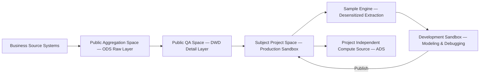
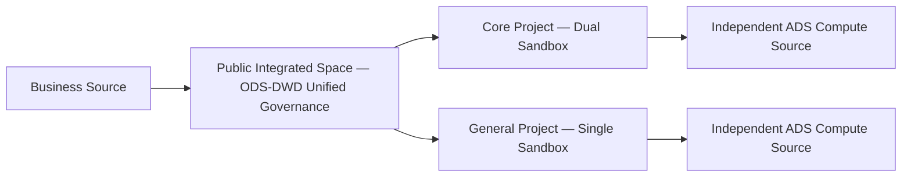
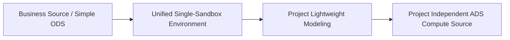

# FAQ (Frequently Asked Questions)

This document compiles common questions and answers from Ottomi Nexus users. If your question is not listed here, feel free to submit it via [GitHub Issues](../../issues) or send an email to info@oceandatum.com.

---

## Table of Contents

- [1. Product & Commercialization FAQ](#1-product--commercialization-faq)
  - [1.1 What is the core positioning of Ottomi Nexus? What business problems does it solve?](#11-what-is-the-core-positioning-of-ottomi-nexus-what-business-problems-does-it-solve)
  - [1.2 What are the key differences between the Community, Professional, and Enterprise editions?](#12-what-are-the-key-differences-between-the-community-professional-and-enterprise-editions)
  - [1.3 What are the usage scope and limitations of the free Community Edition?](#13-what-are-the-usage-scope-and-limitations-of-the-free-community-edition)
  - [1.4 Commercial edition licensing model, license types, and usage boundaries](#14-commercial-edition-licensing-model-license-types-and-usage-boundaries)
  - [1.5 How are open-source and closed-source boundaries defined? Which modules will be open-sourced?](#15-how-are-open-source-and-closed-source-boundaries-defined-which-modules-will-be-open-sourced)
  - [1.6 Does it support private deployment, offline environments, and air-gapped networks?](#16-does-it-support-private-deployment-offline-environments-and-air-gapped-networks)
  - [1.7 How does it adapt to different industries (manufacturing, government, finance, energy, etc.)?](#17-how-does-it-adapt-to-different-industries-manufacturing-government-finance-energy-etc)
  - [1.8 Version upgrade rules, iteration cadence, and update guarantee mechanism](#18-version-upgrade-rules-iteration-cadence-and-update-guarantee-mechanism)
  - [1.9 Commercial after-sales support scope, response rules, and technical support methods](#19-commercial-after-sales-support-scope-response-rules-and-technical-support-methods)
  - [1.10 Is custom development and project customization supported?](#110-is-custom-development-and-project-customization-supported)
- [2. Quick Start & Basic Usage FAQ](#2-quick-start--basic-usage-faq)
  - [2.1 What is the overall workflow for getting started with Ottomi Nexus?](#21-what-is-the-overall-workflow-for-getting-started-with-ottomi-nexus)
  - [2.2 What steps are needed for first-time initialization after deployment?](#22-what-steps-are-needed-for-first-time-initialization-after-deployment)
  - [2.3 What types of heterogeneous data sources are supported for quick integration?](#23-what-types-of-heterogeneous-data-sources-are-supported-for-quick-integration)
  - [2.4 How to create a project, data space, and business subject directory?](#24-how-to-create-a-project-data-space-and-business-subject-directory)
  - [2.5 How to configure account login, role permissions, and team members?](#25-how-to-configure-account-login-role-permissions-and-team-members)
  - [2.6 How to perform basic data sync, data ingestion, and basic processing?](#26-how-to-perform-basic-data-sync-data-ingestion-and-basic-processing)
  - [2.7 Can't find a page feature entry or stuck on basic operations — how to self-diagnose?](#27-cant-find-a-page-feature-entry-or-stuck-on-basic-operations--how-to-self-diagnose)
  - [2.8 Browser compatibility, frontend access, and UI display anomaly handling](#28-browser-compatibility-frontend-access-and-ui-display-anomaly-handling)
  - [2.9 Basic feature trial recommendations and simplest onboarding steps for beginners](#29-basic-feature-trial-recommendations-and-simplest-onboarding-steps-for-beginners)
  - [2.10 High-frequency daily usage notes and basic standards](#210-high-frequency-daily-usage-notes-and-basic-standards)
  - [2.11 What are the global modules on the homepage? What is the relationship between business planning and project spaces? What is the difference between Dev-Prod mode and Basic mode?](#211-what-are-the-global-modules-on-the-homepage-what-is-the-relationship-between-business-planning-and-project-spaces-what-is-the-difference-between-dev-prod-mode-and-basic-mode)
- [3. Architecture & Technical Integration FAQ](#3-architecture--technical-integration-faq)
  - [3.1 Overall technical architecture, core components, and design philosophy of Ottomi Nexus](#31-overall-technical-architecture-core-components-and-design-philosophy-of-ottomi-nexus)
  - [3.2 Underlying tech stack, dependent middleware, and integrated open-source components](#32-underlying-tech-stack-dependent-middleware-and-integrated-open-source-components)
  - [3.3 Xinchuang environment compatibility, domestic databases, and domestic server support](#33-xinchuang-environment-compatibility-domestic-databases-and-domestic-server-support)
  - [3.4 Dual-sandbox mechanism and RBAC+ABAC unified permission architecture](#34-dual-sandbox-mechanism-and-rbacabac-unified-permission-architecture)
  - [3.5 How to integrate multimodal capabilities, AI Intelligence Center, and knowledge base?](#35-how-to-integrate-multimodal-capabilities-ai-intelligence-center-and-knowledge-base)
  - [3.6 MCP/API interface capabilities and third-party system integration (coming soon)](#36-mcpapi-interface-capabilities-and-third-party-system-integration-coming-soon)
  - [3.7 Cluster deployment, distributed architecture, and high-availability deployment](#37-cluster-deployment-distributed-architecture-and-high-availability-deployment)
  - [3.8 Heterogeneous data fusion, cross-database joins, and data warehouse modeling](#38-heterogeneous-data-fusion-cross-database-joins-and-data-warehouse-modeling)
  - [3.9 Secondary development extension methods and custom component development standards](#39-secondary-development-extension-methods-and-custom-component-development-standards)
  - [3.10 Data security, isolation strategy, and sensitive data governance design](#310-data-security-isolation-strategy-and-sensitive-data-governance-design)
  - [3.11 Data quality inspection engine capabilities and DAMA standard coverage](#311-data-quality-inspection-engine-capabilities-and-dama-standard-coverage)
  - [3.12 Difference and collaboration between data asset management and the asset marketplace](#312-difference-and-collaboration-between-data-asset-management-and-the-asset-marketplace)
  - [3.13 Is a trusted data space platform supported?](#313-is-a-trusted-data-space-platform-supported)
- [4. Operations & Troubleshooting FAQ](#4-operations--troubleshooting-faq)
  - [4.1 Minimum hardware requirements for local/server deployment](#41-minimum-hardware-requirements-for-localserver-deployment)
  - [4.2 How to resolve installation failures, port conflicts, and missing dependencies?](#42-how-to-resolve-installation-failures-port-conflicts-and-missing-dependencies)
  - [4.3 Service start/stop, log viewing, and runtime status monitoring](#43-service-startstop-log-viewing-and-runtime-status-monitoring)
  - [4.4 Troubleshooting data sync failures, connection timeouts, and data source connectivity](#44-troubleshooting-data-sync-failures-connection-timeouts-and-data-source-connectivity)
  - [4.5 Version migration, environment migration, data backup and recovery](#45-version-migration-environment-migration-data-backup-and-recovery)
  - [4.6 System lag, performance load, and resource usage optimization](#46-system-lag-performance-load-and-resource-usage-optimization)
  - [4.7 Containerized deployment and Docker-related issue handling](#47-containerized-deployment-and-docker-related-issue-handling)
  - [4.8 Security hardening, port protection, and access whitelist configuration](#48-security-hardening-port-protection-and-access-whitelist-configuration)
  - [4.9 Upgrade failures, patch updates, and config file compatibility issues](#49-upgrade-failures-patch-updates-and-config-file-compatibility-issues)
  - [4.10 Common error codes and quick troubleshooting guide](#410-common-error-codes-and-quick-troubleshooting-guide)
  - [4.11 Operations management system](#411-operations-management-system)
- [5. Selection & General Q&A FAQ](#5-selection--general-qa-faq)
  - [5.1 How does Ottomi Nexus differ from assembling Apache SeaTunnel / DataHub / DolphinScheduler separately?](#51-how-does-ottomi-nexus-differ-from-assembling-apache-seatunnel--datahub--dolphinscheduler-separately)
  - [5.2 Is the Community Edition really feature-complete? Will key features require payment later?](#52-is-the-community-edition-really-feature-complete-will-key-features-require-payment-later)
  - [5.3 Can Ottomi Nexus be used without a dedicated data warehouse or big data team?](#53-can-ottomi-nexus-be-used-without-a-dedicated-data-warehouse-or-big-data-team)
  - [5.4 What technical background is needed to deploy Ottomi Nexus?](#54-what-technical-background-is-needed-to-deploy-ottomi-nexus)
  - [5.5 What operating systems does Ottomi Nexus support? Can it be installed on Windows or macOS?](#55-what-operating-systems-does-ottomi-nexus-support-can-it-be-installed-on-windows-or-macos)
  - [5.6 Where can I download the installation package? Is it available on GitHub?](#56-where-can-i-download-the-installation-package-is-it-available-on-github)
  - [5.7 What is DataHub? Why does it need to be installed before Ottomi Nexus?](#57-what-is-datahub-why-does-it-need-to-be-installed-before-ottomi-nexus)
  - [5.8 Does installing Ottomi Nexus require internet access? Can it be installed in a fully air-gapped environment?](#58-does-installing-ottomi-nexus-require-internet-access-can-it-be-installed-in-a-fully-air-gapped-environment)
  - [5.9 Do the Community and Commercial editions use the same installation package? Does upgrading require reinstallation?](#59-do-the-community-and-commercial-editions-use-the-same-installation-package-does-upgrading-require-reinstallation)
  - [5.10 What additional configuration is needed for AI features? Can Community Edition users use them?](#510-what-additional-configuration-is-needed-for-ai-features-can-community-edition-users-use-them)
  - [5.11 Does Ottomi Nexus support real-time data processing, or only offline batch processing?](#511-does-ottomi-nexus-support-real-time-data-processing-or-only-offline-batch-processing)
  - [5.12 What is the level of built-in BI analytics? Can it replace a dedicated BI tool?](#512-what-is-the-level-of-built-in-bi-analytics-can-it-replace-a-dedicated-bi-tool)
  - [5.13 What multi-language versions are available? Can overseas teams use it?](#513-what-multi-language-versions-are-available-can-overseas-teams-use-it)
  - [5.14 Will Community Edition data be locked? Can existing data be retained when upgrading to Commercial Edition?](#514-will-community-edition-data-be-locked-can-existing-data-be-retained-when-upgrading-to-commercial-edition)
  - [5.15 Can individual resource dimensions be expanded separately if Community Edition limits are insufficient?](#515-can-individual-resource-dimensions-be-expanded-separately-if-community-edition-limits-are-insufficient)
  - [5.16 What are the advantages of Ottomi Nexus over traditional commercial data platform products?](#516-what-are-the-advantages-of-ottomi-nexus-over-traditional-commercial-data-platform-products)
  - [5.17 How frequently is the platform updated? Can Community Edition users get new features promptly?](#517-how-frequently-is-the-platform-updated-can-community-edition-users-get-new-features-promptly)
  - [5.18 How costly is data migration? Is switching from another data platform to Ottomi Nexus complex?](#518-how-costly-is-data-migration-is-switching-from-another-data-platform-to-ottomi-nexus-complex)
  - [5.19 Is data security guaranteed for Community Edition users? Does the product collect or transmit any data?](#519-is-data-security-guaranteed-for-community-edition-users-does-the-product-collect-or-transmit-any-data)
  - [5.20 How to quickly validate whether Ottomi Nexus fits our needs? Is there a demo environment?](#520-how-to-quickly-validate-whether-ottomi-nexus-fits-our-needs-is-there-a-demo-environment)
  - [5.21 How does the product perform in Xinchuang environments? Are there any success stories?](#521-how-does-the-product-perform-in-xinchuang-environments-are-there-any-success-stories)
  - [5.22 Does it support Kubernetes (K8s) deployment?](#522-does-it-support-kubernetes-k8s-deployment)
  - [5.23 What should be noted about Docker mirror source configuration? What to do if image pulls fail on domestic networks?](#523-what-should-be-noted-about-docker-mirror-source-configuration-what-to-do-if-image-pulls-fail-on-domestic-networks)
  - [5.24 What are the default admin credentials? Must they be changed after deployment?](#524-what-are-the-default-admin-credentials-must-they-be-changed-after-deployment)
  - [5.25 What does the built-in Demo project contain? What features can it help me understand?](#525-what-does-the-built-in-demo-project-contain-what-features-can-it-help-me-understand)
- [6. Official Contact](#6-official-contact)

---

## 1. Product & Commercialization FAQ

### 1.1 What is the core positioning of Ottomi Nexus? What business problems does it solve?

Ottomi Nexus is a multimodal AI data platform independently developed by Shanghai Oceandatum Computer Technology Co., Ltd. Based on the DataOps philosophy, it is positioned as an enterprise-grade full-chain data processing platform with the core concept of "connecting resources, coordinating business, and securing governance."

The platform primarily addresses the following enterprise data pain points:

- **Breaking down data silos**: Natively supports dozens of mainstream heterogeneous data sources and provides a JDBC driver extension mechanism — simply provide the corresponding database driver, adapt the dialect, and add table creation statements to quickly integrate more data source types, unifying data across all business systems.
- **Reducing governance costs**: AI assists with data aggregation, quality inspection, and standard recommendations, reducing labor-intensive operations.
- **Strengthening security and compliance**: Automatic classification and grading scanning, data lineage tracking, dual-sandbox isolation, and full operation auditing.
- **Lowering the barrier to use**: Visual drag-and-drop operations allow business personnel to participate in data warehouse modeling and data analysis.
- **Simplifying deployment and operations**: Single-package one-click deployment, supports air-gapped intranet environments.

### 1.2 What are the key differences between the Community, Professional, and Enterprise editions?

All three editions use the **same installation package**. The Community Edition has **fully aligned core features with no restrictions**, and continuously shares the latest feature upgrades. Differences are only in resource usage limits and service levels:

| Comparison Item        | Community Edition                        | Professional Edition        | Enterprise Edition             |
| ---------------------- | ---------------------------------------- | --------------------------- | ------------------------------ |
| Price                  | Free forever| Commercial license          | Commercial license             |
| Parallel compute nodes | 1                | 2+, scalable on demand      | Unlimited                      |
| Registered users       | 8                                        | 40| Unlimited                      |
| Project spaces         | 30                                       | 150                         | Unlimited                      |
| Data sources           | 12                                       | 60                          | Unlimited                      |
| Data models            | 500                                      | 2,500                       | Unlimited                      |
| Metric models| 100                                      | 500                         | Unlimited                      |
| Scheduled tasks        | 300                                      | 1,500                       | Unlimited                      |
| Data services / APIs   | 200                                      | 1,000                       | Unlimited                      |
| Dedicated tech support | None (community support)                 | Gold service (4h response)  | Platinum service (2h response) |
| Suitable for           | SMEs, individuals, testing & validation  | Mid-size enterprises, multi-business lines | Group enterprises, ultra-large scale |

### 1.3 What are the usage scope and limitations of the free Community Edition?

**Usage scope**:

- Targeted at SMEs, startups, and individual developers — no enterprise certification required.
- Supports fully private deployment; all data runs on your own servers / intranet.
- Core features fully open, including data ingestion, AI-assisted data governance, data warehouse modeling, data asset management, basic BI analytics, and permission management.

**Default limitations**:

- Resource limits as shown in the table above; upgrading to a commercial edition is required once limits are reached.
- No one-on-one dedicated technical support, in-depth troubleshooting, or on-site services.
- Case submission access not included (can be purchased separately).
- General Q&A available through GitHub Issues public community by default.

### 1.4 Commercial edition licensing model, license types, and usage boundaries

**Licensing model**:

- Implements a **perpetual license + annual service separation** mechanism.
- Perpetual license is valid indefinitely; mainline version feature upgrades are free.
- Upon annual service expiration, only manual technical support and Case access are disabled — already-unlocked software resources are not locked.

**License types**:

- **Professional Edition**: After commercial authorization, a device-specific License is issued, uniquely bound to the MAC address.
- **Enterprise Edition**: Must be upgraded on top of a Professional Edition license, replacing it with an unlimited global License while retaining all existing configurations and data.

**Activation method**: Generate an environment code (based on MAC address and other hardware information) through the software management center. The official team generates an activation code based on the environment code, which unlocks the edition upon entry.

**Usage boundaries**: Cracking, tampering with, or unauthorized commercial use or redistribution of the License is strictly prohibited. See [LICENSE](./LICENSE) for details.

### 1.5 How are open-source and closed-source boundaries defined? Which modules will be open-sourced?

**Closed-source (data platform core)**:

- Core data processing capabilities of the data platform.
- Security governance and permission system.

**Planned open-source (upper-layer data applications)**:

- Master Data Management (MDM)
- Intelligent Q&A / Smart Query
- Multimodal search
- Trusted Data Space frontend modules
- Intelligence Center API / MCP call examples and development specifications

Open-source modules will include deployment, usage, and development documentation, with a continuous compatibility mechanism with the closed-source underlying layer. See [ROADMAP](./ROADMAP.md) for details.

### 1.6 Does it support private deployment, offline environments, and air-gapped networks?

Yes. Ottomi Nexus supports the following deployment modes:

- **Private deployment**: All business data and services run within the enterprise's own servers, eliminating data leakage risks at the source.
- **Offline deployment**: Supports completing a full installation in a networked environment with automatic download of all dependency components, then packaging the entire program directory and copying it to an intranet environment for direct deployment — no external network access required throughout.
- **Air-gapped intranet**: Adapts to fully offline and physically isolated environments, fully meeting the security and compliance requirements of government and enterprise units.

### 1.7 How does it adapt to different industries (manufacturing, government, finance, energy, etc.)?

Ottomi Nexus is designed for data-intensive, high-compliance scenarios and has been deployed across multiple industries:

| Industry           | Typical Scenarios|
| ------------------ | ---------------------------------------------------------------------------------------------------------------------- |
| Government         | Cross-department data sharing, data element circulation, public data resource aggregation (deployed in Minhang District, etc.) |
| Finance            | Customer asset integration, transaction data compliance auditing, regulatory reporting|
| Manufacturing      | Full-chain production data governance, supply chain collaboration                                      |
| Energy & Water     | Equipment IoT data aggregation, production operations data analysis|
| Healthcare & Education | Research data management, teaching resource integration|
| Retail & E-commerce | Multi-channel data fusion, consumer profile analysis                                                  |
| Transportation & Logistics | Real-time IoT device data processing (deployed at Pudong Airport, etc.)                                      |

The platform supports rapid customization of landing solutions based on industry characteristics.

### 1.8 Version upgrade rules, iteration cadence, and update guarantee mechanism

- Official continuous iteration and maintenance, with version updates released periodically.
- Core updates include bug fixes, system performance optimization, and core feature enhancements.
- **Community Edition (free)**: Can download the installation package and manually upgrade to mainline iteration versions, completely free.
- **Commercial Edition (paid)**: Free upgrades + official operations assurance, technical support, and dedicated services.
- All version release content is based on GitHub Releases.
- Upper-layer data application modules will be progressively open-sourced.

### 1.9 Commercial after-sales support scope, response rules, and technical support methods

Technical support is divided into three tiers:

| Service Tier | Applicable Edition               | Service Mode   | Response Time | Annual Case Quota |
| ------------ | -------------------------------- | -------------- | ------------- | ----------------- |
| Silver       | Community Edition (purchase required) | 5×8 remote | 8 hours       | 32 cases/year     |
| Gold         | Professional Edition| 5×8 remote     | 4 hours       | 32 cases/year     |
| Platinum     | Enterprise Edition               | 7×24 remote    | 2 hours       | 32 cases/year     |

Case counting standards: Lightweight cases (feature guidance, configuration explanation, within 30 minutes) count as 0.5; standard cases (fault diagnosis, interface debugging, etc.) count as 1.

Issues caused by native product bugs do not deduct Case counts.

### 1.10 Is custom development and project customization supported?

Yes. All edition customers can purchase the following value-added services:

- **On-site implementation**: On-site deployment, environment debugging, landing training, localization adaptation.
- **Dedicated operations**: Long-term on-site presence, 7×24 emergency support, regular inspections.
- **Custom development**: Feature modifications, third-party system integration, personalized interface development.
- **Consulting & planning**: Data platform top-level design, industry data model construction.
- **Business support**: Bidding materials, acceptance cooperation, qualification authorization.

For business cooperation and channel resale inquiries, contact info@oceandatum.com.

---

## 2. Quick Start & Basic Usage FAQ

### 2.1 What is the overall workflow for getting started with Ottomi Nexus?

The platform adopts a design philosophy of **"unified global planning, centralized global governance, development capabilities delegated to projects, and independent project space isolation"**: business planning uniformly creates project spaces; data aggregation, development, modeling, and machine learning all run in closed loops within project spaces; data quality and governance use centralized global management with high-privilege unified verification of full-chain real data, while project spaces + sandbox mechanisms achieve development permission and data isolation, balancing governance security with project agility.

- Global unified planning: Business planning, data source registration, basic permission configuration.
- Global centralized governance: Data quality center, global quality inspection, unified governance management.
- Development归口 to projects: Data aggregation, development, modeling, and machine learning all within projects.
- Project logical isolation: Dual-sandbox, permission boundaries, data isolation mechanisms.

A typical onboarding workflow is as follows:

1. **Deploy and install** — Prepare a Linux server (8C16G), install Docker and Docker Compose, run the installation package to start services.
2. **System login** — Access `http://<server IP>:6626` via browser, log in with the default admin account.
3. **System configuration** — Configure accounts, roles, permissions, and message channels.
4. **Data source integration** — Register heterogeneous data sources in the management center, complete database connection configuration, and confirm data source, ODS, and DWD database connections.
5. **Business planning** — Create project spaces, determine data compute sources (ADS) within project spaces, and plan business segments, subject domains, and business entities.
6. **Data aggregation** — Configure data aggregation tasks from data sources to ODS within project spaces.
7. **Data governance** — In the independent global **Data Quality Management Center**, uniformly configure cross-layer quality inspection rules and data standards, directly view real ODS and DWD business data, and execute full-chain quality inspection; complete clean data warehousing, dirty data identification and governance, ensuring underlying data quality.
8. **Data development** — Governed standard DWD data returns to the data development phase within the project space; model based on DWD layer data, ultimately settling into the project-specific ADS compute layer to support upper-layer business applications. Perform ETL development and data warehouse modeling through the visual canvas.
9. **Data services** — Implement classification and grading scanning, generate API interfaces, configure data sharing and permission approval.
10. **Data assets** — Implement catalog display and application/approval operational process closure in the data asset marketplace. Asset listing for data source tables can be achieved in metadata management; asset listing for compute source tables and metrics can be achieved in business planning project spaces; API listing can be achieved in the data sharing service module. The data asset management menu **will** enable unified asset listing and delisting.

**Permission design logic**

- **Data governance role**: Global high-privilege role that can view all real raw data and perform cross-project quality inspection and governance — the platform's unified data quality management role.
- **Data development role**: Permissions are constrained within the **assigned project space**, isolated via sandbox mechanisms, cannot see global cross-project sensitive data, and can only operate data authorized within the current project.

**What is the difference between the Data Aggregation menu and the Data Input component in data development?**

Both can achieve data aggregation capabilities. The difference is: the Data Aggregation menu is designed for large-scale multi-table data aggregation from data sources to the ODS layer, implemented through page configuration with richer functionality than the Data Input component. The Data Input component is designed for the full ETL workflow.

### 2.2 What steps are needed for first-time initialization after deployment?

1. Ensure the service has started successfully (check the `ocean-platform` container logs for a successful startup message).
2. Access `http://<server IP>:6626` via browser.
3. Log in with the default admin account (recommended to change the password immediately after first login).
4. After entering the system, browse the built-in Demo project and data space to understand the platform's feature layout.

### 2.3 What types of heterogeneous data sources are supported for quick integration?

The platform is based on a self-developed data processing engine (deeply rewritten from Apache SeaTunnel) and natively supports dozens of mainstream heterogeneous data sources, including:

- **Relational databases**: MySQL, PostgreSQL, Oracle, DB2, SQL Server, DM (Dameng), KingbaseES, OceanBase, TiDB, ArgoDB, Greenplum, etc.
- **Big data components**: Hive, ClickHouse, Doris, Presto, Inceptor, etc.
- **Message queues**: Kafka, RabbitMQ, etc.
- **File systems**: CSV, Excel, JSON, XML file imports.
- **API interfaces**: Supports data aggregation via API interfaces.
- **Unstructured data**: Distributed document storage, intelligent document summarization and keyword extraction, image OCR recognition, audio/video content recognition, etc. — requires multimodal large model support.

### 2.4 How to create a project, data space, and business subject directory?

1. In the "Business Planning" module, first complete the data warehouse layering design (ODS source layer, DWD detail layer, ADS application metrics layer, etc.).
2. Create business segments, divide subject domains and business entities.
3. Create project spaces, allocate compute resources and members.
4. The system supports dual-sandbox architecture: development sandbox and production sandbox are isolated to ensure data security.

### 2.5 How to configure account login, role permissions, and team members?

- **Account management**: Add members and configure organizational structure in "System Configuration > Account Management".
- **Role management**: Preset multiple roles (system administrator, data developer, data analyst, business user, etc.), supports custom roles.
- **Permission management**: Supports fine-grained permission control at data source, table, column, and row levels.
- **Unified authentication**: Built-in unified identity authentication system, supports single sign-on.

### 2.6 How to perform basic data sync, data ingestion, and basic processing?

**Data sync**:

- Table aggregation: Select source database and target table, supports full sync, incremental sync, and differential update sync.
- Real-time aggregation: Implement real-time data sync via CDC mechanism.
- File aggregation: Upload files and configure parsing rules.
- API aggregation: Configure API address and parameters, pull data on a schedule.

**Basic processing**:

- Use the visual canvas in the data development module, drag and drop components to build ETL workflows.
- Built-in 95+ development components and 84+ compute functions covering common data processing scenarios.
- Supports wizard-based automatic API generation — no need to write interface code manually.

### 2.7 Can't find a page feature entry or stuck on basic operations — how to self-diagnose?

1. Check the feature module groups in the left navigation bar to confirm the current module.
2. Use the search function at the top of the page to quickly locate feature entries.
3. Refer to the configuration of the built-in Demo project.
4. The system's Intelligence Center module will provide a product manual RAG knowledge base to answer user questions.
5. Search or submit issues via [GitHub Issues](../../issues).
6. Commercial edition users can obtain remote guidance through the dedicated Case system.

### 2.8 Browser compatibility, frontend access, and UI display anomaly handling

- **Recommended browsers**: Chrome (latest version), Edge (latest version).
- **Access URL**: `http://<server IP>:6626`
- **Common anomaly troubleshooting**:
  - Blank page on load: Check if the service has started normally, confirm port 6626 is open.
  - UI display issues: Clear browser cache and retry, or switch to Chrome browser.
  - Login failure: Check if the account and password are correct, confirm the service has fully started.

### 2.9 Basic feature trial recommendations and simplest onboarding steps for beginners

Recommended experience order:

1. Browse the built-in Demo project to understand the platform's overall feature layout.
2. Create a test project space.
3. Connect a MySQL data source to experience data cataloging and aggregation.
4. Try configuring a data quality inspection rule.
5. Build a simple ETL workflow in the data development canvas.
6. Experience asset viewing and lineage tracking in data asset management.

### 2.10 High-frequency daily usage notes and basic standards

- Confirm the current project space and sandbox environment (development/production) before operations.
- Data development tasks should be validated in the development sandbox first before publishing to the production environment.
- Sample data in the development sandbox can be generated from real production data via the sample engine with privacy transformation.
- Schedule large batch data tasks during off-peak hours.
- Regularly check data quality inspection reports and handle anomalous data promptly.
- Risky operations (such as deleting data sources or projects) may cause irreversible system changes — proceed with caution.

### 2.11 What are the global modules on the homepage? What is the relationship between business planning and project spaces? What is the difference between Dev-Prod mode and Basic mode?

#### Global Modules

The R&D Center, Quality Management Center (including quality inspection and governance), Shared Services Center, Asset Application Center, Data Standards, Data Analytics, Intelligence Center, Business Planning, and Management Center visible on the homepage are all **global modules** — accessible to anyone with system and data permissions.

#### Relationship Between Business Planning and Project Spaces

The **Business Planning** module includes **business segment** and **subject domain** construction. Users can create business segments and subject domains , then create corresponding project spaces. Project spaces can add and manage project members.

#### Project Space Modes

Project spaces have 2 modes:

1. **Dev-Prod Mode (Dual-Sandbox Mode)**: Generates mutually linked Dev development and Prod production environments. Uses the sample engine to pull and generate sample data from the production environment for development; after development models are completed and go online, they can be published to the production space. The production space contains real production data, but data browsing permissions can be restricted from developers — developers can only view models, reducing the risk of data leakage.

2. **Basic Mode (Single-Sandbox Mode)**: Development and production share a single sandbox.

#### Project Space Module Selection

Newly created project spaces can select modules included in the R&D Center. The **Data Modeling** module requires selecting a business segment before it can be used.

---

## 3. Architecture & Technical Integration FAQ

### 3.1 Overall technical architecture, core components, and design philosophy of Ottomi Nexus

**Design philosophy**: Based on a framework of "**atomic components + parallel computing architecture + visual workflow orchestration + data processing closed loop**", driven by DataOps at its core, **achieving full-domain capability decoupling through componentization**, ensuring independent iteration, flexible combination, and on-demand assembly of each business module.

**Technical architecture layers**:

- **Data ingestion layer**: Front-end machine cataloging and aggregation (Ottomi-Atlas), multi-source heterogeneous data ingestion (dozens of mainstream data sources, supports extension via JDBC drivers).
- **Data storage and compute layer**: Distributed parallel computing engine (Ottomi-Engine), distributed task scheduling engine.
- **Data governance layer**: Data quality management (Ottomi-Guardian), data standards management, classification and grading, data security (Ottomi-Secure).
- **Data development layer**: Visual ETL development (Ottomi-Forge), data warehouse modeling (Ottomi-Metrix), machine learning.
- **Data asset layer**: Data asset management (Ottomi-Vault), data lineage, relationship graph, tag center.
- **Data service layer**: Data sharing hub (Ottomi-ShareLink), automatic API generation and management, dynamic desensitization.
- **Trusted Data Space** (Ottomi-TrustForge): Zero-trust architecture, connector management, sample engine.

### 3.2 Underlying tech stack, dependent middleware, and integrated open-source components

**Core tech stack**:

- Cloud-native containerized architecture (Docker / Docker Compose).
- Distributed parallel computing and storage.
- Microservices architecture with independent deployment and scaling per module.

**Deeply integrated open-source components**:

| Component               | License     | Purpose                                      |
| ----------------------- | ----------- | -------------------------------------------- |
| Apache SeaTunnel        | Apache 2.0  | Data integration and migration|
| Apache DolphinScheduler | Apache 2.0  | Distributed task scheduling                  |
| DataHub                 | Apache 2.0  | Metadata management and data catalog         |
| DataEase                | GPL-3.0     | BI data analytics and visualization|
| MinIO                   | AGPLv3      | Distributed object storage for documents and files. MinIO is deployed independently, runs as a separate process, accessed via API (aggregated) — MinIO source code is not modified. |

Full component list and license declarations are in [NOTICE](./NOTICE).

**Prerequisites**:

- Docker v28.3.3 or above.
- Docker Compose v2.36.1 or above.
- DataHub V1.30 (metadata service).

### 3.3 Xinchuang environment compatibility, domestic databases, and domestic server support

- **Domestic operating systems**: Adapted for Debian/RedHat-based domestic OS, with continuous full-feature validation in Xinchuang labs.
- **Domestic databases**: Supports DM (Dameng), KingbaseES, OceanBase, GBase, Inceptor, ArgoDB, StarRocks, etc.
- **Server architecture**: Currently supports X86_64; aarch64 support is in the roadmap.
- The platform has passed multiple Xinchuang certifications, meeting government and enterprise compliance requirements.

### 3.4 Dual-sandbox mechanism and RBAC+ABAC unified permission architecture

**Dual-sandbox mechanism**:

- Each project space can be configured with independent **development sandbox** and **production sandbox** dual environments, or a single integrated sandbox as needed — flexible deployment to fit different business scales.
- The development environment uses desensitized simulated sample data by default; developers never touch raw sensitive business data, building a data security baseline at the environment level.
- All development, debugging, model orchestration, and task configuration are confined to the development sandbox; after validation, they are uniformly deployed to the production sandbox via a standardized release process.
- Physical isolation between development and production environments effectively prevents accidental operations, data leakage, and logic conflicts.

**Permission architecture**:

- The platform builds a unified identity authentication system for global account management, unified login, and unified authorization.
- **RBAC** (Role-Based Access Control): Preset multiple roles, supports customization.
- **ABAC** (Attribute-Based Access Control): Supports fine-grained permissions at data source, table, column, and row levels.
- Complete permission approval workflow: Full lifecycle management of data requests, approvals, subscriptions, and authorizations.

**Sandbox data processing and data warehouse full-chain flow**:

Global unified data warehouse layering, independent project space isolation, project-specific compute sources (ADS metrics layer), and global asset unified management form a complete, actionable data closed loop.

1. Global standard data warehouse chain: `Business source systems → ODS raw layer → DWD detail standard layer`
2. Project-specific compute source: Each project space has an independent compute source database, equivalent to a **project-specific ADS metrics layer**, used to store metrics, dimension tables, and statistical results for the current subject domain.
3. Data isolation rules: Each project space's data is naturally isolated; all business subject projects uniformly obtain clean data from the global DWD detail layer.
4. Global asset management: The platform distinguishes between asset management and asset marketplace modules, enabling unified search and viewing of raw datasets, cataloged resources, and each project's compute source metrics and dimension table assets.

#### 3.4.1 Large Complex Architecture (Enterprise-grade · Full Role Separation · Standard Dual-Sandbox)

Suitable for large enterprises, multi-department collaboration, high data governance requirements, and strict role separation.

**1) Dedicated public project spaces (platform-side unified governance)**

- **Data aggregation dedicated space**: Managed by dedicated aggregation personnel, uniformly connecting all business heterogeneous data sources, completing data sync and ingestion, and settling raw data into the **global ODS raw layer** — preserving source data in its original form as the unified data foundation for the entire platform.
- **Data quality inspection dedicated space**: Configured with independent quality inspection permissions and a dedicated QA team, accessing only full ODS real data to perform completeness, consistency, standardization, and business logic validation; after data cleansing, standardization, and dirty data governance, high-quality data is uniformly loaded into the **global DWD detail standard layer**. ODS and DWD are global shared base layers and the unified data source for all business projects.

**2) Business subject project spaces (business-side modeling output)**

- Spaces are isolated by subject domain; each business project defaults to **dual-sandbox strong isolation mode**.
- All business projects **prohibit direct connection to business sources or the ODS layer**, uniformly extracting subject-relevant clean data from the global DWD detail layer to ensure consistent calibration and controllable data quality.
- Standard dual-sandbox flow:
  - Production sandbox: Stores referenced DWD standard detail data as the globally trusted baseline.
  - Sample desensitization sync: Developers use the platform's sample engine to extract limited data samples with custom settings, processed through privacy desensitization and computability transformation, then synced to the development sandbox.
  - Offline development and modeling: All script development, model design, metrics processing, and task debugging are completed entirely within the development sandbox.
  - One-click publish: After model and job acceptance, uniformly published to the corresponding project's production sandbox.
  - Permission isolation: Developers can only view models and task configurations — **no access to raw production data**.

**3) Project-specific ADS compute source output**

Each project's production sandbox has a dedicated **independent compute source database (project-level ADS layer)**; processed business metrics, dimension tables, report results, and subject summary data are uniformly stored in the current project's ADS layer, achieving subject data isolated storage and independent operations.

**4) Global asset unified management**

The platform's asset management module uniformly manages: ODS raw datasets, DWD standard details, each project's independent ADS compute sources, dimension tables, and metrics assets. Through asset cataloging, tagging, and search capabilities, all data assets are queryable, manageable, and traceable across the platform; the asset marketplace supports cross-project compliant sharing.



#### 3.4.2 Medium General Architecture (Government & Enterprise Standard · Hybrid Flexible)

Suitable for government/enterprise units and mid-size companies where roles can be merged, governance is moderately standardized, and both security and efficiency are balanced.

1. **Simplified public governance**: Data aggregation and quality inspection can be merged into **one public project space**, retaining the `ODS → DWD` standard layering to ensure basic data governance capability is not lost.
2. **Flexible sandbox selection**: Core sensitive subject projects use **dual-sandbox isolation**; ordinary analytics and non-sensitive business projects use **single-sandbox integrated mode** to simplify operations.
3. **Data source rules unchanged**: All business projects still use the global DWD detail layer as the unified data source to ensure consistent calibration; a small number of non-core scenarios may simplify the chain as needed.
4. **Compute source and asset logic unchanged**: Each project space still has an independent ADS compute source layer with metrics and dimension tables isolated by subject; global assets are uniformly cataloged, and asset management and marketplace functions are fully reused.



#### 3.4.3 Lightweight Simple Architecture (Community Edition · Integrated Minimal)

Suitable for small teams, department-level applications, rapid deployment, and scenarios without strict role separation — the default form for the Community Edition.

1. **Minimal environment architecture**: Globally uses **single-sandbox integrated mode**, no longer splitting independent development and production environments; relies on RBAC+ABAC fine-grained permissions for logical isolation.
2. **Greatly simplified chain**: Complex layering can be weakened as needed — the simplest mode directly connects to business source systems for data ingestion; the standard simplified mode retains basic ODS settlement with lightweight quality inspection before direct project use.
3. **Project construction approach**: No separate public governance space; data ingestion, lightweight quality inspection, model development, and metrics output are all completed in a unified environment. A single person or small team can handle the full workflow and quickly complete data analytics and report building.
4. **Core product capabilities retained**: Even in minimal deployment, the **project-independent compute source (ADS)** design is retained, with metrics and dimension tables isolated by project; basic asset cataloging, asset search, and resource transparency capabilities are fully retained for smooth future scaling.



#### 3.4.4 Summary of Core Logic Across Three Modes

| Core Logic         | Description|
| ------------------ | ------------------------------------------------------------------------------------------------------------------------------------------------------------ |
| Unified foundation | Regardless of mode, the global `ODS raw layer + DWD standard detail layer` serves as the shared foundation, ensuring data and quality consistency.|
| Project isolation  | All business subjects use independent project spaces as carriers; data is naturally isolated with dual-sandbox or single-sandbox selected as needed.          |
| Independent compute source | Each project has a dedicated ADS compute source layer for unified storage of metrics, dimension tables, and business result data.                    |
| Elastic governance | Large-scale full role separation, medium merged and balanced, small-scale minimal lightweight — three plans matched as needed.                               |
| Global assets      | Unified asset management and marketplace; raw data, standard details, and project metrics assets are all manageable, queryable, and shareable across the platform. |
| Full edition coverage | Fully adapts to the differentiated deployment needs of Community, Professional, and Enterprise editions.                                                  |

### 3.5 How to integrate multimodal capabilities, AI Intelligence Center, and knowledge base?

**Multimodal processing (with room for improvement)**:

- **Text**: Keyword extraction, summarization.
- **Image**: Object recognition, scene recognition (via multimodal large model capabilities).
- **Audio/Video**: Speech-to-text, video content analysis.
- **OCR recognition**: Document recognition and unstructured data processing.

**Future open plans**: Multimodal comprehensive search, etc.

**AI Intelligence Center**:

- **Large model configuration**: Configure connections to public internet large models or privately deployed large models.
- **Intelligent agents**: Currently provides a data aggregation agent and a data development agent, with built-in and online-editable prompt templates.
- **LangChain toolchain**: Leveraging LangChain intelligent orchestration capabilities combined with a self-encapsulated full toolchain and platform APIs, building domain-specific data intelligent agents. Supports flexible prompt editing, session management, and AI full-process assistance for data aggregation, development, and quality inspection through large model + multi-tool collaboration.

**Future open plans**: The Intelligence Center will open APIs, MCP extensions, Skills plugin mechanisms, and supporting development examples, enabling third parties to build custom applications on the platform.

### 3.6 MCP/API interface capabilities and third-party system integration (coming soon)

**API service capabilities**:

- Automatic data API generation: Automatically encapsulates data tables as REST APIs through wizard-based configuration.
- API marketplace management: API publishing, registration, version management, traffic monitoring.
- Dynamic desensitization: Automatic data desensitization during API calls.
- Full-chain auditing: API call logs, monitoring and alerting.

**Third-party system integration**:

- Supports integration with external systems via API interfaces.
- Supports direct database connection integration.
- Supports real-time data stream integration via message queues (Kafka, etc.).
- MCP (Model Context Protocol) standard interfaces will be opened in the future to support AI Agent integration.

### 3.7 Cluster deployment, distributed architecture, and high-availability deployment

- **Single-node deployment**: Suitable for department-level use or POC validation (minimum 8C16G).
- **Cluster deployment**: Professional Edition supports 2+ nodes, scalable on demand; Enterprise Edition supports unlimited scaling.
- **High availability**: Built-in distributed parallel computing engine and task scheduling engine; compute nodes can be self-configured on the node management page, supporting elastic scaling.
- **Containerized**: Docker-based containerized deployment with independent scaling per microservice module.

Enterprise Edition is recommended to configure higher-spec servers to support large-scale computation.

### 3.8 Heterogeneous data fusion, cross-database joins, and data warehouse modeling

**Heterogeneous data fusion**:

- Natively supports unified ingestion and automatic field mapping for dozens of mainstream data source types; for data sources not yet built-in, simply provide a JDBC driver with simple dialect adaptation and table creation statement compatibility to integrate.
- Supports unified management of structured data (relational databases) and unstructured data (documents, images, audio/video).
- Real-time and offline lakehouse integration: Unified processing of streaming and batch data.

**Data warehouse modeling**:

- Based on Kimball dimensional modeling theory.
- Visual construction of dimension tables and fact tables.
- Drag-and-drop multi-dimensional Cube design, supporting slicing, roll-up, and drill-down.
- Three-tier metrics system: atomic metrics, derived metrics, and composite metrics.
- Users can select any system-compatible database as the data warehouse storage.

**Does Ottomi Nexus restrict which database is used as the data warehouse?**

**Full ecosystem, no binding**: Not limited to the Hadoop ecosystem — fully compatible with MySQL, Oracle, SQL Server, Doris, Greenplum, Hive, and other relational, MPP, and big data warehouses. Any database can serve as the business data warehouse foundation.

**What type of database does Ottomi Nexus use for its own configuration database?**

MySQL is recommended as the system configuration database. Ottomi Nexus has previously adapted to PostgreSQL and Oracle as configuration databases, but as features iterate, detailed validation is required.

For domestic databases, DM (Dameng) is recommended as the system configuration database.

Commercial edition users who need to use other database types as the configuration database can contact info@oceandatum.com for adjustments.

### 3.9 Secondary development extension methods and custom component development standards

At the current stage, secondary development is primarily achieved through:

- Ottomi Nexus adopts a modular architecture design, supporting functional extension via **custom components** while reserving standardized integration interfaces for data interoperability and capability linkage with external business systems. The **core API documentation and open capabilities** for developers are still being refined and have not been officially released. For deep secondary development needs, contact us through the technical support channel to learn about the architecture design and development specifications in advance.
- Use the platform's built-in visual development components to build custom data processing workflows.

Planned future extension methods:

- Intelligence Center API / MCP standard interfaces supporting third-party custom application development.
- Skills plugin mechanism.
- Open-source application modules available for secondary development.

Note: Decompiling, reverse engineering, or redistributing core modules without official written authorization is strictly prohibited. See [CONTRIBUTING](./CONTRIBUTING.md) for details.

### 3.10 Data security, isolation strategy, and sensitive data governance design

- **Classification and grading**: Automatic identification and scanning with a built-in classification and grading rule library.
- **Encrypted storage**: Encrypted storage at the aggregation end, supporting SM2/SM3/SM4 national cryptographic algorithms.
- **Desensitization**: Development environments use desensitized simulated data; API calls support dynamic desensitization.
- **Dual-sandbox isolation**: Physical isolation between development and production environments; development sandbox can use sample data.
- **Multi-level permission management**: Builds a **three-tier permission system of system permissions, project permissions, and data permissions**; system permissions control menu page and feature button access by role; project permissions achieve project member isolation and intra-project data boundary management; data permissions cover data source management authorization, table-level, row-level, and column-level fine-grained permission management.
- **Process audit trail**: Full electronic retention of data requests and approval workflows, with complete and traceable operation records.
- **API security protection**: Full API interface log monitoring, configurable access whitelists and dynamic signature verification, automatic identification and blocking of abnormal call behavior.
- **Tamper-proof logs**: Full operation auditing ensuring behavior is traceable and auditable.
- **Compliance adaptation**: Deep adaptation to GDPR, Data Security Law (DSL), and Personal Information Protection Law (PIPL).
- **Data lineage**: Full-chain data lineage tracking, queryable from source to application.

### 3.11 Data quality inspection engine capabilities and DAMA standard coverage

The platform's built-in data quality inspection module follows the DAMA International Data Management Association's data quality management framework, covering the following six core dimensions:

| Inspection Dimension | Description                |
| -------------------- | --------------------------------------------------------------------------------------------- |
| Completeness         | Detects field null rates and record missing rates to ensure dataset completeness.             |
| Consistency| Cross-table, cross-database, and cross-system data consistency validation.                    |
| Accuracy             | Business rule validation to detect whether data conforms to expected value ranges and logic.  |
| Timeliness           | Data arrival timeliness detection to identify delayed and lagging data.                       |
| Uniqueness           | Primary key and composite unique key duplicate detection to eliminate redundant data.         |
| Standardization      | Encoding standards, naming conventions, and format compliance validation.                     |

**Quality inspection capability highlights**:

- Supports both **scheduled batch inspection** and **real-time streaming inspection** modes.
- Built-in industry-general rule library, supports custom quality inspection rules.
- Inspection results automatically generate analysis reports with dynamic report output.
- Problem data (dirty data) identified during inspection is automatically flagged and returned to upstream for correction.
- Quality inspection health rate is incorporated into the asset value assessment dimension.

### 3.12 Difference and collaboration between data asset management and the asset marketplace

**Asset management (management side)**:

- Data source table asset listing/delisting is managed in metadata management.
- Compute source table (ADS layer data produced by project spaces) listing/delisting is done in business planning project spaces for dimension tables, fact tables, and metrics.
- API online/offline management is done in the interface marketplace with customizable approval workflows.
- Business classification directory trees can be built for data source tables and compute source tables. Business classification and data security classification/grading are two separate concepts.
- The current version **does not open** the source resource cataloging process or the data asset cataloging process — metadata management is used instead.

**Asset marketplace (sharing side)**:

- Facing all platform business users.
- Provides a self-service search and browsing experience similar to a "data supermarket."
- Features include: asset catalog, classification and grading, lineage tracking, asset detail viewing.
- Supports multi-dimensional asset value assessment from catalog completeness, quality inspection health rate, and usage activity — also useful for identifying "zombie data" (assets not accessed or used for extended periods).
- Supports cross-project compliant sharing: users can discover, apply for, and subscribe to compliant data assets from other project spaces.
- In the asset marketplace, selecting tables from the asset catalog allows applying for table permissions and table API read permissions; upon approval, APIs are automatically generated and can be viewed in "My Interfaces" in the Shared Services Center.
- If the needed asset catalog cannot be found in the asset marketplace, a work order application process is available, viewable in Management Center > Process Approval, with offline coordination follow-up.
- All sharing actions go through a permission approval process to ensure compliant data circulation.

**Collaboration**: Administrators view details and business classifications through the asset management module; business users discover and apply for usage through the asset marketplace — forming a complete data asset operations closed loop.

### 3.13 Is a trusted data space platform supported?

Yes, upgrading to a trusted data space system is supported. Ottomi Nexus is a foundational capability module for trusted data space systems oriented toward multi-party data collaboration scenarios. The trusted data space system is designed on a zero-trust architecture:

**Core mechanisms**:

- **Connector management**: After application, full-featured connectors are automatically distributed and deployed to achieve secure connection between data providers and consumers. Full-featured connectors include Ottomi Nexus's data aggregation, development, quality inspection, modeling, and sharing capabilities.
- **Sample engine**: Automatically implements lightweight privacy computing, extracting desensitized samples from real production data for use in development environments.
- **Dual-sandbox + permission management**: Development-production dual-sandbox mechanism combined with RBAC+ABAC fine-grained permissions to prevent data leakage.
- **Space management**: Create independent data spaces on demand; each space's data is naturally isolated with support for cross-space compliant sharing.
- **Log attestation**: Ottomi Nexus has tamper-proof log auditing capabilities and can integrate with blockchain for attestation management.

**Applicable scenarios**:

- Secure data sharing across subsidiaries within a group.
- Cross-department data element circulation in government affairs.
- Data collaboration across upstream and downstream supply chains.
- Targeted data opening to external partners.

---

## 4. Operations & Troubleshooting FAQ

### 4.1 Minimum hardware requirements for local/server deployment

| Item               | Requirement|
| ------------------ | --------------------------------------------------------------------------- |
| Operating system   | Mainstream Linux distributions (Debian/RedHat-based, including domestic OS) |
| Server architecture | X86_64 (aarch64 support coming in future releases)                         |
| Minimum specs      | 8-core CPU + 16 GB RAM                |
| Prerequisites      | Docker v28.3.3+, Docker Compose v2.36.1+                                    |
| Metadata service   | DataHub V1.30                |
| Network port       | 6626 (Web access port)                                                      |

### 4.2 How to resolve installation failures, port conflicts, and missing dependencies?

**Installation startup failure**:

1. Check whether Docker and Docker Compose versions meet requirements.
2. Confirm the installation package was fully extracted: `tar zxvf ocean.tar.gz`
3. Check whether the DataHub connection address and Token configuration in `docker-compose.yml` are correct.

**Port conflict**:

- Default port is 6626; if occupied, modify the port mapping in `docker-compose.yml`.
- Use `netstat -tlnp | grep 6626` to check port occupancy.

**Missing dependencies**:

- Confirm Docker service is running: `systemctl status docker`
- Confirm DataHub is installed and running normally.
- Confirm a DataHub Token has been generated and configured in `docker-compose.yml`.

### 4.3 Service start/stop, log viewing, and runtime status monitoring

**Service start/stop**:

```bash
# Start all services
docker-compose up -d

# Stop all services
docker-compose down
```

**Log viewing**:

```bash
# Real-time platform container logs
docker logs -f --tail=20 ocean-platform

# View all container statuses
docker-compose ps
```

**Status monitoring**:

- Use `docker-compose ps` to check the running status of each container.
- After successful platform startup, a success message will appear in the logs.
- Access `http://<IP>:6626` in a browser to confirm the Web service is available.

### 4.4 Troubleshooting data sync failures, connection timeouts, and data source connectivity

1. **Check data source connection**: On the data source management page, click "Test Connection" to verify network and authentication information.
2. **Check firewall**: Confirm the network path from the server to the data source is normal and relevant ports are open.
3. **Check logs**: View error messages in the `ocean-platform` container logs.
4. **Check resources**: Confirm the server has sufficient CPU, memory, and disk resources.
5. **Check drivers**: Confirm the JDBC driver or connector version for the data source is compatible.

### 4.5 Version migration, environment migration, data backup and recovery

- **Version upgrade**: After official release of a new version, follow the upgrade documentation; commercial edition users can upgrade mainline versions for free.
- **Environment migration**: Deploy the same version on the new environment, migrate data via data export/import.
- **Data backup**: Regularly back up Docker-mounted data directories and databases.
- **License migration**: Commercial edition users migrating environments need to regenerate the environment code and apply for a new activation code.

### 4.6 System lag, performance load, and resource usage optimization

- **Resource check**: Use `top`, `free -m`, `df -h` to check CPU, memory, and disk usage.
- **Task scheduling**: Schedule large batch data processing tasks during off-peak hours.
- **Node scaling**: Commercial editions support adding compute nodes to improve parallel processing capacity.
- **Data cleanup**: Regularly clean up expired scheduling logs, temporary data, and test data.
- **Configuration optimization**: Adjust Docker container resource limit parameters based on server specs.

### 4.7 Containerized deployment and Docker-related issue handling

- **Container won't start**: Check `docker-compose.yml` configuration, port conflicts, and disk space.
- **Image pull failure** (online deployment): Check network connectivity, confirm the image registry address is accessible.
- **Offline image import**: Use `docker load -i <image file>` to import offline images.
- **Insufficient container resources**: Adjust `mem_limit`, `cpus`, and other parameters in `docker-compose.yml`.
- **Incorrect container time**: Confirm the host timezone is configured correctly, or mount the timezone file in docker-compose.

### 4.8 Security hardening, port protection, and access whitelist configuration

- **Port protection**: Only open necessary ports (6626); restrict access to other ports via firewall.
- **Access whitelist**: Configure IP whitelists via firewall (iptables / firewalld).
- **Default password change**: Immediately change the default admin password after deployment.
- **HTTPS configuration**: Production environments should configure Nginx reverse proxy with SSL enabled.
- **Log auditing**: Regularly check system logs and monitor abnormal access and operation records.
- **Regular updates**: Promptly apply official security patches and version updates.

### 4.9 Upgrade failures, patch updates, and config file compatibility issues

- Back up data directories and configuration files before upgrading.
- Carefully read the official upgrade notes and confirm version compatibility.
- If a failure occurs during upgrade, do not restart midway — check logs first to identify the cause.
- When configuration files change, compare the differences between old and new `docker-compose.yml` files.
- After upgrading, verify that all functional modules are working normally.

### 4.10 Common error codes and quick troubleshooting guide

Since the platform uses containerized deployment, the general troubleshooting steps are:

1. **Check container status**: `docker-compose ps` to confirm all containers are running normally.
2. **Check container logs**: `docker logs <container name>` to view specific error messages.
3. **Check resource usage**: `docker stats` to view container resource consumption.
4. **Check network connectivity**: Confirm inter-container network communication is normal.
5. **Check configuration files**: Confirm `docker-compose.yml` and environment variable configurations are correct.

If the issue cannot be resolved independently:

- Community Edition users: Submit via [GitHub Issues](../../issues) with version information, deployment environment, reproduction steps, and relevant logs.
- Commercial edition users: Submit through the dedicated Case system for remote technical support.

### 4.11 Operations management system

Paid customers can obtain and deploy an operations management system for the multimodal AI data platform at no additional cost. Features include: **hardware and service monitoring**, **data backup**, and **primary-standby architecture + automatic failover**. Data backup primarily targets the system's own configuration database and configuration files.

Ottomi Nexus adopts a distributed architecture with a **single primary management node** for overall scheduling; if the primary node fails, it will directly impact the platform's overall business operations. For paid customers, the platform provides a dedicated **operations management system** free of charge, with built-in **automatic primary-standby node switching** — when the primary management node fails, the standby node automatically takes over to ensure uninterrupted platform operation. The operations management system also provides **hardware resource monitoring, service operation monitoring, and core data backup** capabilities, comprehensively ensuring the long-term reliable and secure operation of the multimodal AI data platform.

---

## 5. Selection & General Q&A FAQ

### 5.1 How does Ottomi Nexus differ from assembling Apache SeaTunnel / DataHub / DolphinScheduler separately?

This is the most common question raised by technical personnel during evaluation. Although Ottomi Nexus deeply integrates these excellent open-source components, there are fundamental differences:

| Comparison Dimension | Assembling Open-Source Tools Separately | Ottomi Nexus |
| -------------------- | --------------------------------------- | ------------ |
| **Integration** | Requires self-installation, configuration, and joint debugging of multiple independent components; version compatibility must be self-managed. | Single-package integrated delivery; all components pre-integrated and pre-configured, ready out of the box. |
| **User experience** | Each component has an independent interface with frequent switching and high learning costs. | Unified Web interface; full-chain operations completed on one platform. |
| **Data security** | Requires self-building of permission systems, desensitization mechanisms, and audit logs. | Built-in classification/grading, dual-sandbox isolation, desensitization engine, and full-chain auditing. |
| **AI capabilities** | No built-in AI assistance; requires self-integration with large models. | Built-in AI Intelligence Center with intelligent cataloging, governance, and development assistance. |
| **Data asset operations** | No unified asset management; data scattered across components. | Built-in data asset management, asset marketplace, lineage tracking, and value assessment. |
| **Data warehouse modeling** | Requires other tools or manual SQL writing. | Built-in visual data warehouse modeling, dimensional modeling, Cube design, and metrics system. |
| **Operations cost** | Requires professional operations team to maintain multiple systems. | Containerized deployment greatly reduces operations complexity. |
| **Data compliance** | Requires self-adaptation to Data Security Law, PIPL, and other regulations. | Built-in compliance system with automatic classification/grading and national cryptographic algorithm support. |

In short: assembling open-source components separately only yields a toolset, while Ottomi Nexus is a **complete data platform product** providing a full-chain capability closed loop from data ingestion to data service.

### 5.2 Is the Community Edition really feature-complete? Will key features require payment later?

Features are genuinely not restricted. All three editions use the **exact same installation package** with identical core feature modules — differences are only in **resource usage limits** and **technical support service levels**.

Specifically, the Community Edition includes all of the following core capabilities:
- Data ingestion (dozens of mainstream data sources, supports JDBC driver extension)
- AI-assisted data governance (intelligent cataloging, aggregation, and recommendations)
- Data quality inspection (DAMA six-dimension quality inspection)
- Visual data warehouse modeling (dimensional modeling, Cube design, metrics system)
- Data asset management (asset cataloging, lineage tracking, asset marketplace)
- Data security management (classification/grading, desensitization, audit logs)
- BI data analytics and visualization
- Fine-grained permission management (RBAC+ABAC)
- Task scheduling engine
- API data service generation and management

The Community Edition is limited by **usage scale**: e.g., 8 users, 30 project spaces, 12 data sources, 1 compute node, etc. If your team size and data volume fall within the Community Edition limits, it can fully meet formal business usage needs.

### 5.3 Can Ottomi Nexus be used without a dedicated data warehouse or big data team?

Yes. Ottomi Nexus is designed specifically to lower the barrier to data governance:

- **Visual operations**: All core features (data ingestion, development, warehouse modeling, analytics) are completed through a Web interface with drag-and-drop and wizard-based configuration — no complex code required.
- **AI assistance**: Built-in AI agents assist with data cataloging, aggregation, and development, reducing manual operations.
- **Built-in components**: 95+ development components and 84+ compute functions covering common data processing scenarios.
- **Ready out of the box**: Built-in Demo project and sample data to quickly understand platform capabilities.
- **Lightweight**: Runs on an 8C16G server without requiring a big data cluster.

A small team or even a single person can handle the full workflow of data ingestion, governance, modeling, and analytics. That said, basic database and SQL knowledge is recommended for large-scale data processing or complex architecture design.

### 5.4 What technical background is needed to deploy Ottomi Nexus?

The deployment barrier is low. The following basic skills are sufficient:

- Basic Linux operations (file extraction, directory navigation, process inspection).
- Ability to install Docker and Docker Compose (the platform documentation provides installation guides).
- Familiarity with basic Docker commands (`docker-compose up -d`, `docker logs`).

No compilation or complex middleware configuration is required. Following the INSTALL.md documentation, the entire process from environment preparation to platform access takes approximately 15 minutes.

Regarding daily operations:
- **Community Edition**: Containerized deployment makes daily operations very lightweight. Basic Docker operations are sufficient for startup/shutdown, log viewing, and status monitoring — a dedicated operations person is generally not needed.
- **Commercial editions**: For cluster deployment, performance optimization, and high-availability architecture, an operations person or official operations service is recommended.

### 5.5 What operating systems does Ottomi Nexus support? Can it be installed on Windows or macOS?

Ottomi Nexus currently only supports **Linux operating systems**, specifically:
- Debian-based distributions (Ubuntu, Debian, etc.)
- RedHat-based distributions (CentOS, RHEL, Rocky Linux, etc.)
- Domestic operating systems (Kylin, UnionTech UOS, etc. — continuously being validated)

Server architecture currently only supports **X86_64**; aarch64 is in the roadmap.

**Windows and macOS direct installation is not supported.** If using Windows or macOS as a local development environment, you can experience the platform via:
- Virtual machine (VMware, VirtualBox, etc.) with Linux installed
- WSL2 (Windows Subsystem for Linux 2)

Production environments should use Linux servers.

### 5.6 Where can I download the installation package? Is it available on GitHub?

The installation package is large (contains complete containerized deployment files and dependency configurations). Due to GitHub's large file limitations, the package is available through:

- **GitHub Releases**: Download links are provided on the GitHub Releases page with each version release.
- **Official website**: Available at https://www.oceandatum.com
- **Business email**: Contact info@oceandatum.com to obtain the package or for inquiries.

The installation package contains a `docker-compose.yml` configuration file and dependency initialization directory — upload to a Linux server, extract, and it's ready to use.

### 5.7 What is DataHub? Why does it need to be installed before Ottomi Nexus?

**DataHub** is a data metadata management and data catalog platform open-sourced by LinkedIn (Apache License 2.0). In Ottomi Nexus, it serves as the metadata service foundation.

Ottomi Nexus depends on DataHub for:
- Automatic data source metadata collection and management
- Data asset catalog construction
- Data lineage relationship tracking and display
- Data asset search and discovery

**Installation steps**:
1. Install DataHub V1.30 following the official DataHub documentation.
2. Generate a Token in DataHub (select never expires) and save it.
3. Configure the Token in Ottomi Nexus's `docker-compose.yml`.
4. Start Ottomi Nexus — it will automatically connect to the DataHub metadata service.

DataHub installation documentation is linked in the INSTALL.md file.

### 5.8 Does installing Ottomi Nexus require internet access? Can it be installed in a fully air-gapped environment?

Both deployment modes are fully supported:

**Online deployment** (server has network access):
- Pull Docker images online with automatic dependency resolution.
- Server must be able to access Docker image registries (configuring a Docker mirror accelerator is recommended for domestic networks).

**Offline deployment** (server completely air-gapped):
- **Step 1**: Pull all images on a networked server and export them as an offline installation package (image files).
- **Step 2**: Copy the offline package to the target intranet server.
- **Step 3**: Import images using `docker load -i`, then run the installation startup command.
- No external network access required throughout; no data leaves the network.

Offline deployment is especially suitable for government, military, and financial environments with strict network isolation requirements.

### 5.9 Do the Community and Commercial editions use the same installation package? Does upgrading require reinstallation?

Yes, all three editions use the **exact same installation package**.

**Upgrading from Community to Commercial Edition** requires no reinstallation:
1. Generate an environment code in the platform's management center (based on server MAC address and other hardware information).
2. Submit the environment code to the official team to receive the corresponding activation code.
3. Enter the activation code in the platform to unlock the corresponding resource limits.
4. **All existing data, configurations, and project spaces are fully retained** — no migration needed.

Upgrading from Professional to Enterprise Edition works the same way: replace with the unlimited global License while retaining all existing configurations and data.

### 5.10 What additional configuration is needed for AI features? Can Community Edition users use them?

Community Edition users **can fully use** AI intelligent assistance features, but need to configure large model access themselves.

**Configuration method**:
- In the platform's AI Intelligence Center, configure a connection to a public internet large model API (e.g., Qwen, ERNIE Bot, etc.) or a privately deployed large model.
- AI assistance capabilities are available immediately after configuration.

**Current AI capabilities include**:
- **Data aggregation agent**: AI-assisted aggregation operations.
- **Data development agent**: AI-assisted data quality inspection, development, and ETL workflow building.
- Built-in prompt templates with online editing and customization support.
- LangChain intelligent orchestration supporting large model + multi-tool collaboration.

**Note**: Large model API call costs are charged by the model service provider and are unrelated to Ottomi Nexus product fees.

### 5.11 Does Ottomi Nexus support real-time data processing, or only offline batch processing?

Ottomi Nexus supports both **real-time and offline** data processing modes:

**Offline batch processing**:
- Full/incremental data sync.
- Scheduled batch task execution.
- Suitable for T+1 data warehouse scenarios.

**Real-time data processing**:
- Real-time database change capture via CDC (Change Data Capture) mechanism.
- Real-time data stream ingestion via Kafka and other message queues.
- Real-time aggregation and stream-batch unified processing.

You can flexibly choose real-time or offline mode based on business needs, or mix both modes within the same project.

### 5.12 What is the level of built-in BI analytics? Can it replace a dedicated BI tool?

Ottomi Nexus has built-in data analytics and visualization capabilities based on **DataEase** (an open-source BI platform by FlyCloud), meeting enterprise daily data analytics and report display needs:

- **Visual drag-and-drop report building** — no code required.
- Supports multiple chart types (bar charts, line charts, pie charts, dashboards, etc.).
- Supports data large-screen construction.
- Rich built-in data visualization components.

**Applicable scenarios**:
- Internal enterprise daily data dashboards and operational reports.
- Department-level data analytics and visualization.
- Rapid prototyping and POC validation.

**Positioning note**: The built-in BI in Ottomi Nexus focuses on the "analytics display" phase of the full data platform chain, best used in conjunction with data governance and warehouse modeling capabilities. For highly specialized and complex BI needs (e.g., fine-grained report permission management, complex nested reports), Ottomi Nexus data can also be connected to other professional BI tools via API.

### 5.13 What multi-language versions are available? Can overseas teams use it?

Ottomi Nexus currently provides **Chinese, English, Japanese, and Korean** language versions with identical features across all languages.

**Overseas team usage**: Fully supported. The platform supports private deployment on overseas servers with no data leaving the country. Note:
- The official technical support team primarily serves in Chinese; English communication can be directed to the business email.
- Product documentation is currently primarily in Chinese; other language documentation is being continuously developed.

### 5.14 Will Community Edition data be locked? Can existing data be retained when upgrading to Commercial Edition?

**Data will not be locked, and all existing data is fully retained.**

- All data generated during Community Edition use (data source configurations, project spaces, data models, scheduled tasks, asset information, etc.) is fully available after upgrading to a commercial edition.
- The upgrade process only involves entering an activation code to unlock resource limits — no data migration or reinstallation required.
- Commercial edition perpetual licenses are valid indefinitely; mainline version feature upgrades are free.
- Upon annual service expiration without renewal, only manual technical support and Case access are disabled — **already-unlocked software resources and data are not locked**.

### 5.15 Can individual resource dimensions be expanded separately if Community Edition limits are insufficient?

**Upgrade model**:

- Community Edition → Professional Edition: Can unlock single or multiple dimensions with bundled discounts across four dimensions: parallel compute nodes, personnel and collaboration scale, data processing scale, and scheduling and service scale.
- Professional Edition → Enterprise Edition: All resource limits are removed at once.

If your needs are right at the limit of a single Community Edition dimension, contact info@oceandatum.com to discuss specific requirements — the official team can provide flexible solutions based on actual circumstances.

### 5.16 What are the advantages of Ottomi Nexus over traditional commercial data platform products?

| Comparison Dimension | Traditional Commercial Data Platforms | Ottomi Nexus |
| -------------------- | ------------------------------------- | ------------ |
| **Deployment** | Typically SaaS or heavyweight private deployment with long implementation cycles. | Single-package containerized deployment, online in 15 minutes. |
| **Ease of use** | Requires professional big data teams with steep learning curves. | Visual drag-and-drop operations; small teams can get started. |
| **Data sovereignty** | In SaaS mode, data is in the cloud with compliance risks. | 100% private deployment; data fully retained on enterprise premises. |
| **AI capabilities** | Some platforms charge extra for AI features or have restrictions. | Built-in AI Intelligence Center available in Community Edition. |
| **Cost structure** | High procurement costs, typically starting at millions. | Community Edition free forever; commercial editions purchased as needed. |
| **Adaptability** | Highly standardized with high customization costs. | Supports rapid customization for industry scenarios with lightweight flexible architecture. |
| **Offline environments** | Most depend on cloud services. | Fully supports air-gapped intranet and offline environments. |
| **Xinchuang adaptation** | Partial support. | Deep adaptation to domestic OS and databases; passed multiple Xinchuang certifications. |

Ottomi Nexus is best suited for **SMEs and government/enterprise units that need data autonomy and control, want low-cost rapid deployment, and have requirements for private deployment and offline environments**.

### 5.17 How frequently is the platform updated? Can Community Edition users get new features promptly?

- Official continuous iteration and maintenance with periodic version updates.
- Updates include bug fixes, performance optimization, and core feature enhancements.
- **All editions (including Community Edition) can download the latest installation package for upgrades** — mainline iteration versions are free.
- Version releases are based on GitHub Releases.

Community Edition and commercial edition users receive the **same version software** with fully synchronized feature updates. The only difference: commercial edition users can enjoy official assisted upgrade services, while Community Edition users perform upgrades independently.

### 5.18 How costly is data migration? Is switching from another data platform to Ottomi Nexus complex?

Migration cost depends on the complexity of your current data environment, but the overall migration process is relatively straightforward:

**Lightweight migration** (e.g., from Excel/CSV or a single database):
- Directly register the data source in Ottomi Nexus and configure data sync tasks.
- No migration scripts required.

**Medium complexity migration** (e.g., existing multiple data sources and data warehouses):
- Ottomi Nexus natively supports dozens of mainstream data source types for direct integration without replacing existing databases; for data sources not yet built-in, simply provide a JDBC driver for quick extension.
- Existing warehouse models can be visually rebuilt in the platform.
- The system supports replacing existing data processing scripts with visual ETL development, or using SQL, Python, Java, and other script components to run existing scripts directly. However, rebuilding data development models using built-in components is recommended — built-in components are not tied to specific database types, so if the database needs to change in the future, models can run on different databases without modification.

**General migration steps**:

1. Deploy Ottomi Nexus.
2. Register existing data source connections.
3. Configure data aggregation tasks to sync existing data to the platform.
4. Rebuild warehouse models and business processes in the platform.
5. Configure data services and API connections to downstream systems.

Ottomi Nexus is positioned as "integration" rather than "replacement" — your existing databases and systems remain unchanged; Ottomi Nexus manages them uniformly at the upper layer.

### 5.19 Is data security guaranteed for Community Edition users? Does the product collect or transmit any data?

Data security is a core design principle of Ottomi Nexus, and Community Edition users enjoy the same complete security guarantees:

- **Fully local data**: All data and processing services run on your own servers/intranet, with no dependency on any external cloud services.
- **No data transmission**: Ottomi Nexus **does not collect, transmit, or externally send any user data** to official servers or third parties.
- **Complete security capabilities**: The Community Edition includes full classification/grading automatic scanning, desensitization engine, dual-sandbox isolation, and full-chain audit logs.
- **Encryption support**: Supports SM2/SM3/SM4 national cryptographic algorithm encrypted storage.
- **Compliance adaptation**: Deep adaptation to Data Security Law, Personal Information Protection Law, and GDPR requirements.

Simply put: deployed on your own server, data is entirely under your control.

### 5.20 How to quickly validate whether Ottomi Nexus fits our needs? Is there a demo environment?

The following validation methods are available:

**1. Self-deploy and experience (recommended)**:
- Prepare an 8C16G Linux server.
- Follow the INSTALL.md documentation — approximately 15 minutes to complete deployment.
- After deployment, the platform has a **built-in complete Demo project and demo data space** — experience the full workflow out of the box without preparing test data.

**2. Feature trial suggestions**:
- Browse the built-in Demo project to understand the platform's overall feature layout.
- Create a test project space.
- Connect an existing data source (e.g., MySQL) to experience data aggregation.
- Try configuring a data quality inspection rule.
- Build a simple ETL workflow in the data development canvas.
- Experience data asset management and lineage tracking.

**3. Business engagement**:
- For product demonstrations, in-depth discussions, or POC support, contact info@oceandatum.com to arrange.

An online demo environment is being prepared — stay tuned.

### 5.21 How does the product perform in Xinchuang environments? Are there any success stories?

Ottomi Nexus has substantial Xinchuang environment deployments:

**Xinchuang adaptation**:
- Domestic OS: Adapted for Debian/RedHat-based domestic operating systems with continuous full-feature validation in Xinchuang labs.
- Domestic databases: Supports DM (Dameng), KingbaseES, OceanBase, GBase, Inceptor, ArgoDB, StarRocks, etc.
- Domestic encryption: Supports SM2/SM3/SM4 national cryptographic algorithms.
- Passed multiple Xinchuang certifications, meeting government and enterprise compliance requirements.

**Selected benchmark cases**:
- **Government**: Deployed in Shanghai, Nanjing, Qingdao, Beijing, Chengdu, and other cities, supporting cross-department data sharing, data element circulation, and public data resource aggregation.
- **Transportation**: Deployed at Pudong Airport and other locations, supporting real-time IoT device data processing.
- **Finance**: Customer asset integration, transaction data compliance auditing.
- **Manufacturing**: Full-chain production data governance, supply chain collaboration.

For specific case details, contact info@oceandatum.com.

### 5.22 Does it support Kubernetes (K8s) deployment?

The current version of Ottomi Nexus is based on **Docker / Docker Compose** containerized deployment and does not natively provide a Kubernetes deployment solution.

For enterprises with existing K8s infrastructure:
- Docker Compose service configurations can be manually converted to K8s resource manifests (Deployment, Service, ConfigMap, etc.) for deployment.
- This approach requires K8s operations experience and is not officially natively supported.

Native K8s deployment support is under consideration for future planning. Contact the official team to provide feedback if there is strong demand.

### 5.23 What should be noted about Docker mirror source configuration? What to do if image pulls fail on domestic networks?

When deploying online on domestic servers, Docker image pulls may fail due to network issues. Configuring a Docker mirror accelerator in advance is recommended:

**Configuration method**:
Modify or create `/etc/docker/daemon.json` and add mirror accelerator configuration:

```json
{
  "registry-mirrors": [
    "https://<mirror-accelerator-address>"
  ]
}
```

Restart Docker after configuration: `systemctl restart docker`

**If pulls still fail**:
- Check server network proxy settings.
- Confirm the firewall allows the ports required by Docker.
- If network conditions are limited, use **offline deployment mode**: pull images in a networked environment, export them, then copy and import on the target server.

### 5.24 What are the default admin credentials? Must they be changed after deployment?

- **Default account**: admin
- **Default password**: 1qaz@WSX

**Strongly recommended to change the default password immediately after first login.** Reasons:
- The default password is public information (documented), leaving it unchanged is a security risk.
- Production deployments should follow security best practices with strong passwords.
- Password can be changed in personal settings after login.

For further security hardening:
- Configure firewall access whitelists to allow only specified IPs to access port 6626 (default port; a method to change it will be provided in the future).
- Configure Nginx reverse proxy with HTTPS for production environments.
- Regularly check system audit logs and monitor abnormal login behavior.

### 5.25 What does the built-in Demo project contain? What features can it help me understand?

After deployment, the platform has a built-in complete **Demo project and Demo data space** — core features can be experienced without preparing additional test data:

**Feature modules covered by the Demo project**:
- **Data source integration examples**: Demonstrates how to register and configure heterogeneous data source connections.
- **Data aggregation**: Demonstrates data aggregation task configuration and execution.
- **Data governance**: Demonstrates quality inspection rule configuration, data standards management, and classification/grading scanning.
- **Data development**: Demonstrates the visual ETL development canvas and development component usage.
- **Data warehouse modeling**: Demonstrates dimensional modeling, fact table construction, and metrics system configuration.
- **Data asset management**: Demonstrates asset catalog, lineage tracking, and asset value assessment.
- **Permission management**: Demonstrates role configuration, data permission assignment, and approval workflows.

New users are recommended to browse the Demo project's configurations and feature layout after first login to build a basic understanding of the platform's overall capabilities, then create an independent project space for hands-on work based on their own business needs.

---

## 6. Official Contact

- **Business email**: info@oceandatum.com
- **Official website**: https://www.oceandatum.com
- **Community support**: [GitHub Issues](https://github.com/Oceandatum/Ottomi-Nexus)
